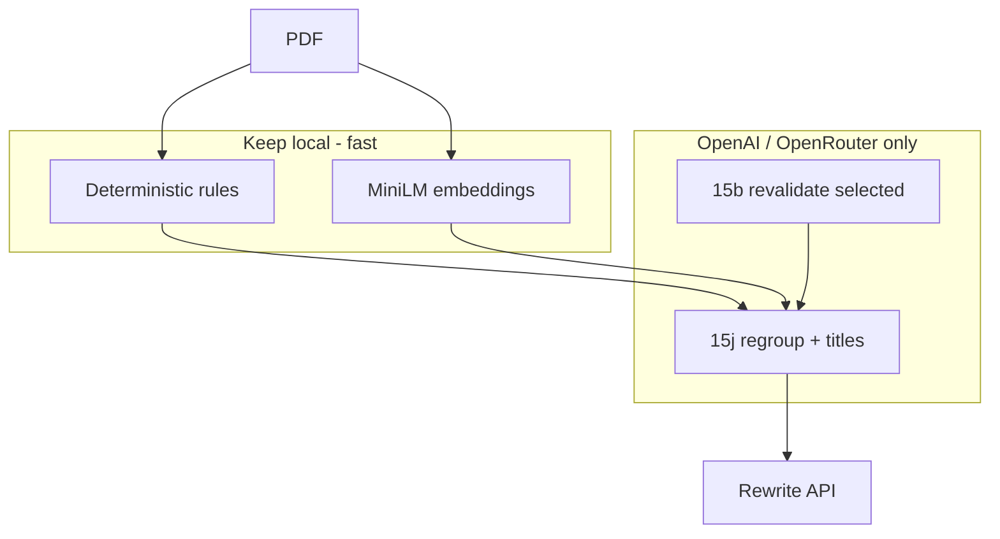

# Change Plan — Cloud Structure (Replace FLAN + BigBird with OpenAI/OpenRouter)

> **Status:** Planned  
> **Date:** 2026-06-09  
> **Branch:** `feature/cloud-structure-openrouter` (to be created after baseline push)

---

## 1. Problem

- **FLAN-T5** and **BigBird** run locally for structure stages (15b, 15e, 15f, 15g, 15h, 15i).
- On Docker deploy: high RAM (~1.5–2.5 GB), slow cold start, CPU-bound, poor title quality vs cloud.
- **Redundant API calls** when `quality_cloud` + `HIERARCHY_OPENAI_ENABLED=1`: 15e LLM + 15f LLM + 15j (3+ calls) overlap on the same titles/chapters.
- Single `.env.example` — no clear **local / dev / prod** split for deployment.

## 2. Goals

1. Remove **FLAN** and **BigBird** from the default production path.
2. Route structure LLM work through **OpenAI or OpenRouter** via existing `LlmChatClient` + `llm_provider.py`.
3. **Minimize API calls** — target **≤6 structure LLM calls** per ~50-section book (excluding rewrite).
4. Keep **MiniLM** for embeddings (RAG, similarity, chapter cohesion) — not replaceable by chat API.
5. Deployment-ready: **3 env profiles** (local, dev, prod), slimmer Docker image, documented compose.

## 3. Non-goals

- Removing MiniLM / sentence-transformers from RAG.
- Changing rewrite parallelization (separate concern).
- LLM qualitative audit grading.

---

## 4. Current vs target call budget

### Current (quality_cloud + 15j, ~53 sections)

| Stage | Backend | Approx calls |
|-------|---------|--------------|
| 15b revalidate | OpenRouter | 0–40 (capped by `DOUBTED_REVALIDATION_MAX`) |
| 15e chapter hierarchy | OpenRouter | 2–3 (batched) |
| 15f heading cleanup | OpenRouter | 2–3 (batched) |
| 15h chapter rename | **FLAN** (local) | N × titles |
| 15i title refinement | **FLAN/BigBird/MiniLM** | N × titles |
| 15j regroup | OpenRouter | 2–3 (batched) |
| 15j names | OpenRouter | 1 |
| 15j polish | OpenRouter | 1 |
| 15g validation | **FLAN** (per ambiguous title) | 0–N |

**Total structure cloud:** ~10–15+ calls **plus** heavy local inference.

### Target (optimized cloud structure)

| Stage | Backend | Approx calls |
|-------|---------|--------------|
| 15b | Rules + MiniLM; cloud **only** `revalidate_selected` | 0–20 |
| 15e | **Rules only** when 15j enabled | **0** |
| 15f | **Rules only** when 15j enabled | **0** |
| 15h | MiniLM reassignment only; rename deferred to 15j | **0** |
| 15i | Rules + MiniLM only (no FLAN/BigBird) | **0** |
| 15j-A | Batched regroup | 2–3 |
| 15j-B | **Combined** names + polish (single hierarchy JSON) | **1** |
| 15g | Rules only; optional batched cloud validate for flagged titles | 0–1 |

**Target structure cloud:** **3–5 calls** (+ up to 20 for 15b revalidation if needed).

---

## 5. Architecture (target)



---

## 6. Implementation phases

### Phase 0 — Git hygiene (before code)

1. Commit all pending work on current branch (`feature/deterministic-toc-metadata`).
2. Push to remote.
3. Create branch: `feature/cloud-structure-openrouter`.

### Phase 1 — Config & env profiles

**New files:**

| File | Purpose |
|------|---------|
| `.env.local` | Developer laptop: optional small PDF test, `APP_ENV=local` |
| `.env.dev` | Shared dev server / staging: OpenRouter, full pipeline |
| `.env.prod` | Production template (no secrets committed) |
| `backend/config/local.yaml` | Overrides: `PIPELINE_MAX_PAGES=25`, debug on |
| `backend/config/dev.yaml` | Cloud structure flags |
| `backend/config/prod.yaml` | Production tunables |

**`APP_ENV` loader** in `backend/src/shared/config.py`:

- `local` → load `config/local.yaml` overlay
- `dev` → load `config/dev.yaml`
- `prod` → load `config/prod.yaml`
- Env file precedence: `.env.{APP_ENV}` → `.env` → `default.yaml`

**Rename ingestion profiles:**

| Profile | Use |
|---------|-----|
| `local` | Was `fast_local` semantics but **no FLAN/BigBird** — rules + MiniLM, optional 15j off for speed |
| `cloud` | Was `quality_cloud` — full optimized cloud structure |
| `prod` | Same as `cloud` + stricter caps, RAG on, debug off |

Update [`backend/src/modules/ingestion/profile.py`](backend/src/modules/ingestion/profile.py) builtins.

**Key env defaults (cloud/prod):**

```env
LLM_PROVIDER=OPENROUTER
INGESTION_PROFILE=cloud
HEADING_CLEANUP_BACKEND=rules_only
HEADING_CLEANUP_USE_LLM=false
CHAPTER_HIERARCHY_USE_LLM=false
CHAPTER_HIERARCHY_USE_BIGBIRD=false
HIERARCHY_OPENAI_ENABLED=true
TITLE_VALIDATION_USE_FLAN=false
DOUBTED_RESOLVER_LLM=
DOUBTED_RESOLVER_MODE=revalidate_selected
DOUBTED_REVALIDATION_MAX=20
HEADING_REFINEMENT_USE_TRANSFORMERS=false
```

### Phase 2 — Remove FLAN + BigBird code paths

**Delete or gate behind `STRUCTURE_LOCAL_MODELS=1` (default off):**

- [`backend/src/modules/structure/final_structuring/models/bigbird_encoder.py`](backend/src/modules/structure/final_structuring/models/bigbird_encoder.py)
- [`backend/src/modules/structure/final_structuring/models/flan_title_cleaner.py`](backend/src/modules/structure/final_structuring/models/flan_title_cleaner.py)
- [`backend/src/modules/structure/final_structuring/models/flan_title_validator.py`](backend/src/modules/structure/final_structuring/models/flan_title_validator.py)

**Refactor callers:**

| Module | Change |
|--------|--------|
| [`heading_title_engine.py`](backend/src/modules/structure/final_structuring/heading_title_engine.py) | Remove `_bigbird_embedding`, `_flan_chapter_title`; MiniLM + rules + optional single batched cloud fallback |
| [`heading_cleanup.py`](backend/src/modules/structure/final_structuring/heading_cleanup.py) | Remove `_flan_cleanup`; backends: `rules_only` \| `openai` \| `openrouter` |
| [`chapter_hierarchy_builder.py`](backend/src/modules/structure/final_structuring/chapter_hierarchy_builder.py) | Remove `_bigbird_refine_assignments`; skip 15e LLM when `HIERARCHY_OPENAI_ENABLED` |
| [`doubted_section_resolver.py`](backend/src/modules/structure/final_structuring/doubted_section_resolver.py) | Remove BigBird branch; use `segment_llm_classifier` + MiniLM only |
| [`chapter_placement.py`](backend/src/modules/structure/final_structuring/chapter_placement.py) | Remove FLAN chapter rename → defer to 15j |
| [`title_validation.py`](backend/src/modules/structure/final_structuring/title_validation.py) | Rules-only 15g; optional `TITLE_VALIDATION_USE_LLM` batched call |
| [`heading_title_validation.py`](backend/src/modules/structure/heading_title_validation.py) | Remove `get_flan_validator`; add optional cloud batch validator |

**New helper:** `backend/src/modules/structure/final_structuring/cloud_title_service.py`

- Single entry: `batch_fix_titles(hierarchy, *, mode: regroup | names | validate)`
- Used by 15j and optional 15g
- Enforces batching via existing `HEADING_CLEANUP_BATCH_SIZE` / `HIERARCHY_OPENAI_REGROUP_BATCH_SIZE`

### Phase 3 — Minimize 15j calls

In [`hierarchy_openai_refinement.py`](backend/src/modules/structure/final_structuring/hierarchy_openai_refinement.py):

1. Keep batched **regroup** (unchanged, ~2–3 calls for 50 sections).
2. **Merge** `_openai_name_corrections` + `_openai_polish_noisy_titles` → one `_openai_fix_all_titles` call with combined system prompt.
3. Add config `HIERARCHY_OPENAI_SKIP_15E_15F_LLM=true` (default true when 15j enabled) wired in `final_structuring_stage.py`.

### Phase 4 — Dependencies & Docker

**[`backend/requirements.txt`](backend/requirements.txt):**

- Move `transformers` to `requirements-structure-local.txt` (optional, dev-only).
- Production `requirements.txt`: keep `sentence-transformers` + `faiss-cpu` for RAG/MiniLM.

**[`backend/Dockerfile`](backend/Dockerfile):**

```dockerfile
# prod: pip install -r requirements.txt (no transformers)
# dev optional target: pip install -r requirements-structure-local.txt
```

**[`docker-compose.yml`](docker-compose.yml):**

- `docker-compose.yml` — base
- `docker-compose.local.yml` — mount volumes, `APP_ENV=local`, env_file `.env.local`
- `docker-compose.prod.yml` — no volume mount, `APP_ENV=prod`, env_file `.env.prod`

### Phase 5 — Tests & docs

- Update/remove: `test_flan_title_cleaner.py`, BigBird references in `test_heading_title_engine.py`
- Add: `test_cloud_title_service.py`, `test_structure_skip_redundant_llm.py`
- Update: `.env.example`, `specs/modules/parameters-config.md`, `models/README.md`
- Run: `pytest backend/tests/unit/`

---

## 7. Deployment matrix

| | **local** | **dev** | **prod** |
|--|-----------|---------|----------|
| `APP_ENV` | local | dev | prod |
| Env file | `.env.local` | `.env.dev` | `.env.prod` |
| Provider | OpenAI or OpenRouter | OpenRouter | OpenRouter |
| `INGESTION_PROFILE` | local | cloud | prod |
| `PIPELINE_MAX_PAGES` | 25 (optional) | 0 | 0 |
| `HIERARCHY_OPENAI_ENABLED` | 0 or 1 | 1 | 1 |
| RAG on upload | skip | on | on |
| Docker compose | `docker-compose.local.yml` | `docker-compose.yml` | `docker-compose.prod.yml` |
| Secrets | `.env.local` (gitignored) | CI / host | host / secret manager |

---

## 8. Rollback

- Set `STRUCTURE_LOCAL_MODELS=1` and install `requirements-structure-local.txt` to restore FLAN/BigBird (temporary).
- Or revert branch.

---

## 9. Definition of done

- [ ] No import of `flan_title_*` or `bigbird_encoder` in default code path
- [ ] `fast_local` profile no longer sets `bigbird` / `flan`
- [ ] Structure LLM calls ≤6 for 50-section book (logged in pipeline meta)
- [ ] `.env.local`, `.env.dev`, `.env.prod` + `APP_ENV` loader
- [ ] Docker prod image builds without `transformers`
- [ ] Unit tests pass
- [ ] One full pipeline run (Family Law) on OpenRouter with audit report

---

## 10. Execution order

1. Git: commit + push baseline → create `feature/cloud-structure-openrouter`
2. Phase 1: env profiles + config loader
3. Phase 2: remove FLAN/BigBird paths
4. Phase 3: consolidate 15j calls + skip redundant 15e/15f LLM
5. Phase 4: Docker + requirements split
6. Phase 5: tests + docs
7. Run Family Law pipeline + quality audit on OpenRouter
