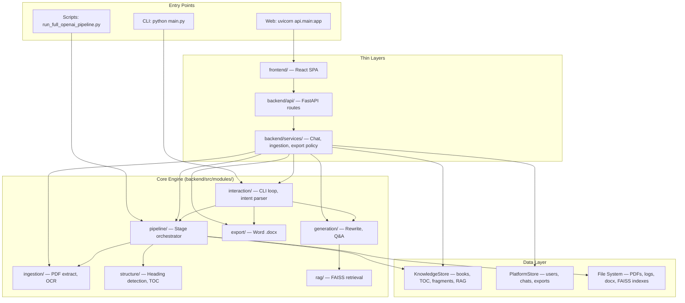

# Architecture — AI Notes Creator Model

> **Role:** System layers, repo layout, ADRs. Pipeline/web/storage detail in linked module specs.  
> **Authority:** Structural changes MUST update this file BEFORE code (MESO Rule 6).

---

## 1. System Overview

AI Notes Creator transforms legal/academic PDF books into structured AI-generated notes. The system has **three entry points** sharing one engine:



---

## 2. Layered Architecture

```
┌─────────────────────────────────────────────────────────────────────────┐
│  Presentation                                                           │
│  ┌─────────────────────┐  ┌─────────────────────┐  ┌─────────────────┐ │
│  │ React SPA (frontend)│  │ CLI (CommandLoop)   │  │ Debug trace     │ │
│  └──────────┬──────────┘  └──────────┬──────────┘  └────────┬────────┘ │
├─────────────┼────────────────────────┼───────────────────────┼──────────┤
│  Web API    │                        │                       │          │
│  ┌──────────▼──────────┐             │                       │          │
│  │ FastAPI routes      │             │                       │          │
│  │ auth, books, chat,  │             │                       │          │
│  │ exports             │             │                       │          │
│  └──────────┬──────────┘             │                       │          │
├─────────────┼────────────────────────┼───────────────────────┼──────────┤
│  Services   │                        │                       │          │
│  ┌──────────▼────────────────────────▼───────────────────────▼────────┐ │
│  │ IngestionService │ ChatService │ export_policy │ upload_jobs      │ │
│  └──────────┬─────────────────────────────────────────────────────────┘ │
├─────────────┼───────────────────────────────────────────────────────────┤
│  Shared     │                                                           │
│  ┌──────────▼──────────┐  ┌─────────────────────────────────────────┐ │
│  │ shared/models.py    │  │ shared/config.py + config/default.yaml    │ │
│  └─────────────────────┘  └─────────────────────────────────────────┘ │
├─────────────────────────────────────────────────────────────────────────┤
│  Modules (mirror /spec/modules/)                                        │
│  ingestion │ structure │ pipeline │ generation │ rag │ export │ storage │
│  interaction │ debug                                                 │
└─────────────────────────────────────────────────────────────────────────┘
```

---

## 3. Repository Layout

```
AI Notes Creater Model/
├── backend/                     # All Python: engine + API + CLI + tests
│   ├── api/                     # FastAPI routes, schemas, main.py
│   ├── auth/                    # OAuth, JWT, dependencies
│   ├── services/                # Chat, ingestion, export policy, upload jobs
│   ├── storage/                 # Platform repositories (users, chats)
│   ├── middleware/              # Rate limiting
│   ├── src/                     # Core engine
│   │   ├── shared/              # config.py, models.py, errors.py
│   │   ├── modules/             # Feature modules (mirror specs/modules/)
│   │   ├── utils/               # pdf_reader, ocr_reader
│   │   ├── config.py            # Shim → shared.config
│   │   └── book_pipeline/       # Stable run_pipeline re-export
│   ├── tests/                   # unit/ + integration/
│   ├── scripts/                 # Ad-hoc pipeline utilities
│   ├── config/                  # default.yaml
│   ├── main.py                  # CLI entry
│   └── requirements.txt
├── frontend/                    # React + Vite SPA
│   ├── auth/                    # API client, AuthProvider, login pages
│   └── src/                     # App.tsx, components, styles
├── specs/                       # Authoritative SDD (this folder)
├── output/                      # Runtime: DB, uploads, exports, RAG indexes
├── models/                      # Local GGUF weights (gitignored)
├── pdfs/                        # Input PDFs
├── .env                         # Secrets (gitignored)
├── .env.example                 # Env template
└── docker-compose.yml           # Backend + frontend containers
```

---

## 4. Pipeline (summary)

PDF → `run_pipeline()` → 13 plugin stages → `PipelineResult`.

**Authoritative detail:** [modules/pipeline-core.md](./modules/pipeline-core.md) (stage order, log artifacts)  
**Structure stages:** [modules/structure-extraction.md](./modules/structure-extraction.md)  
**Debug logs:** [modules/logging-debug.md](./modules/logging-debug.md)

---

## 5. Web Platform (summary)

Frontend → FastAPI routes → services → engine modules. Auth, upload, chat, export.

**Authoritative detail:**
- Requirements (WHAT): [requirements-web-platform.md](./requirements-web-platform.md)
- REST API (HOW): [backend-api.md](./backend-api.md)
- UI (HOW): [frontend.md](./frontend.md)
- Cross-boundary contracts: [ui-backend-integration.md](./ui-backend-integration.md)

---

## 6. Storage (summary)

Single SQLite file: `output/knowledge_base.db` (knowledge + platform tables).  
Files: `output/uploads/`, `output/exports/`, `output/rag_index/`, `logs/run_*/`.

**Authoritative detail:** [data-models.md](./data-models.md) (schemas) · [modules/storage.md](./modules/storage.md) (repositories)

---

## 7. Design Decisions (ADRs)

| ADR | Decision | Rationale |
|-----|----------|-----------|
| ADR-001 | Deterministic core pipeline | Reproducible structure extraction without LLM dependency |
| ADR-002 | `book_pipeline` re-export | Stable import path for scripts and tests |
| ADR-003 | `shared/models.py` canonical | Single runtime model module |
| ADR-004 | SQLite persistence | Local knowledge store; single file for knowledge + platform |
| ADR-005 | Stage JSON logging | Whitelisted artifacts under `logs/run_<timestamp>/` |
| ADR-006 | MESO module layout | `src/modules/*` mirrors `/spec/modules/*` |
| ADR-007 | Config in `/config` | `default.yaml` + env overlay via `shared/config.py` |
| ADR-008 | Plugin pipeline shell | `stages.py` + `PipelineContext`; runner has no business rules |
| ADR-009 | Thin web layers | `api/` + `services/` wrap engine; no duplicate business logic |
| ADR-010 | Shared engine CLI + Web | `main.py` and FastAPI both use `src/modules/` |
| ADR-011 | Deterministic intent routing | `CommandParser` keyword-based; no LLM for classification |
| ADR-012 | In-memory upload jobs | Simple for dev; production needs Redis/DB (backlog) |
| ADR-013 | SSE for chat status | Progress feedback without token streaming complexity |

---

## 8. Import Policy

| Preferred (canonical) | Legacy (removed 2026-06-01) |
|-----------------------|----------------------------|
| `from src.modules.pipeline import run_pipeline` | `from src.core.pipeline import run_pipeline` |
| `from src.shared.models import NormalizedLine` | `from src.core.models import …` |
| `from src.shared.config import OUTPUT_FOLDER` | `from src.config import …` (shim still works) |
| `from src.modules.ingestion.pdf_extractor import extract_pdf` | `from src.ingestion.pdf_extractor import …` |

**Web layer imports:**

```python
from auth.dependencies import get_current_user
from services.chat_service import ChatService
from storage.user_repository import ConversationRepository
```

---

## 9. Technology Stack

| Layer | Technology |
|-------|------------|
| Backend API | FastAPI, Uvicorn, Pydantic |
| Auth | PyJWT, OAuth 2.0 (Google, Apple, Facebook) |
| Engine | Python 3.10+, PyMuPDF, Tesseract (optional) |
| LLM | OpenAI, Gemini, Ollama, llama.cpp (configurable) |
| RAG | FAISS, sentence-transformers (MiniLM) |
| Export | python-docx, Pandoc (optional) |
| Database | SQLite |
| Frontend | React 18, TypeScript, Vite 5 |
| Styling | Plain CSS (dark theme) |
| Deploy | Docker Compose |

---

## 10. Related Specs

| Topic | Spec |
|-------|------|
| REST API details | [backend-api.md](./backend-api.md) |
| Frontend details | [frontend.md](./frontend.md) |
| UI↔Backend contracts | [ui-backend-integration.md](./ui-backend-integration.md) |
| Pipeline stages | [modules/pipeline-core.md](./modules/pipeline-core.md) |
| Data models | [data-models.md](./data-models.md) |
| Tests | [testing.md](./testing.md) |
| How to modify | [future-modifications.md](./future-modifications.md) |
