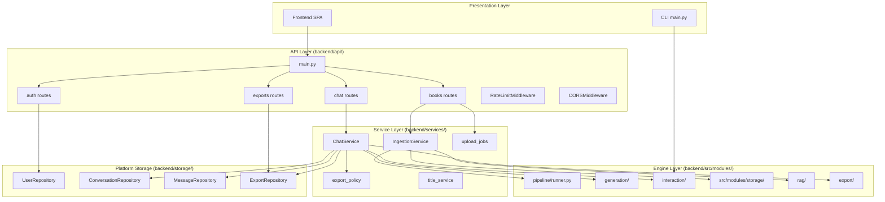
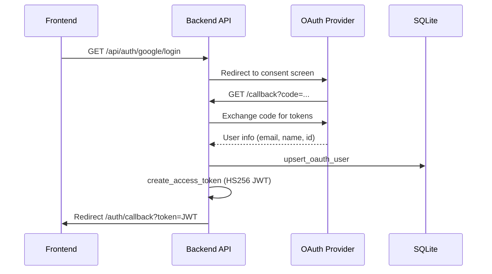
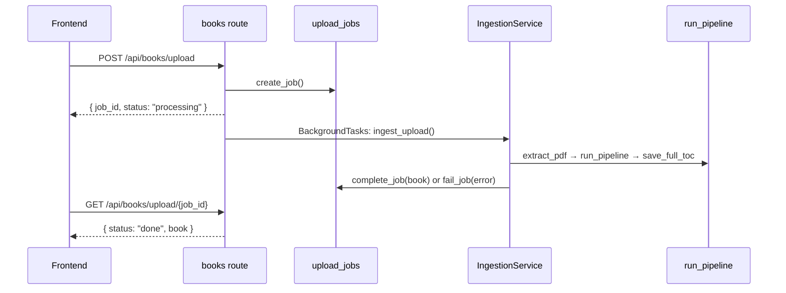

# Backend API Specification — InsightEngine

> **Role:** Authoritative for REST API (endpoints, schemas, services, auth).  
> **Not here:** Requirement IDs → [requirements-web-platform.md](./requirements-web-platform.md) · UI contracts → [ui-backend-integration.md](./ui-backend-integration.md) · Engine → [modules/](./modules/)  
> **Code:** `backend/api/`, `backend/services/`, `backend/auth/`, `backend/storage/`

---

## 1. Purpose

The backend API is a **thin web layer** over the core PDF-to-notes engine (`backend/src/modules/`). It provides:

- OAuth authentication with JWT sessions
- Async PDF upload and ingestion
- Per-user chat with conversation history
- Smart Word export policy
- Secure file downloads

**Design principle:** Routes are thin; business logic lives in `services/`. The engine (`src/modules/`) is shared with the CLI (`main.py`).

---

## 2. Architecture



---

## 3. Application Entry Point

```python
# backend/api/main.py
app = FastAPI(title="InsightEngine API", version="1.0.0")

app.add_middleware(CORSMiddleware, allow_origins=get_auth_settings().cors_origins)
app.add_middleware(RateLimitMiddleware)

app.include_router(auth.router, prefix="/api")
app.include_router(books.router, prefix="/api")
app.include_router(chat.router, prefix="/api")
app.include_router(exports.router, prefix="/api")

@app.get("/api/health")
def health():
    return {"status": "ok", "service": "insightengine-api"}
```

**Run:**

```bash
cd backend
uvicorn api.main:app --reload --port 8000
```

---

## 4. API Endpoints (Complete Reference)

### 4.1 Health

| Method | Path | Auth | Response |
|--------|------|------|----------|
| GET | `/api/health` | No | `{ status: "ok", service: "ai-notes-creator-api" }` |

### 4.2 Authentication

| Method | Path | Auth | Request | Response |
|--------|------|------|---------|----------|
| GET | `/api/auth/config` | No | — | `{ auth_enabled: bool, allow_guest: bool }` |
| POST | `/api/auth/guest` | No | — | `GuestSessionResponse` `{ user: UserProfile, token: str\|null }` (403 only if `allow_guest=false`) |
| GET | `/api/auth/{provider}/login` | No | provider: google\|apple\|facebook | 302 redirect to OAuth |
| GET | `/api/auth/{provider}/callback` | No | Query: code, state, user (Apple) | 302 → `{FRONTEND_URL}/auth/callback?token={JWT}` |
| GET | `/api/auth/me` | Bearer JWT | — | `UserProfile` |

**OAuth flow:**



**JWT payload:**

```json
{
  "sub": "user_id",
  "email": "user@example.com",
  "exp": 1718000000,
  "iat": 1717400000
}
```

**Guest mode** — `POST /api/auth/guest` behavior depends on settings:

| `AUTH_ENABLED` | `ALLOW_GUEST` | Result |
|---|---|---|
| false | (any) | Shared dev identity, no token (`{user, token: null}`) |
| true | true | Isolated, persisted guest user + short-lived JWT (`{user, token}`) |
| true | false | `403` |

The frontend stores the returned token (if any) and uses it as a normal Bearer JWT,
so guests get per-session isolation for books/conversations/exports.

```python
# backend/auth/dependencies.py
def get_current_user(...) -> UserRecord:
    if not settings.auth_enabled:
        return get_dev_user()  # shared local-dev-user
    # ... validate Bearer JWT (covers OAuth users AND guest-issued tokens)
```

### 4.3 Books

| Method | Path | Auth | Request | Response |
|--------|------|------|---------|----------|
| POST | `/api/books/upload` | Bearer | `multipart/form-data: file` (PDF) | `UploadJobResponse` |
| GET | `/api/books/upload/{job_id}` | Bearer | — | `UploadStatusResponse` |
| GET | `/api/books` | Bearer | — | `list[BookSummary]` |

**Upload constraints:**
- PDF only (`.pdf` extension)
- Max size: `MAX_UPLOAD_MB` (default 100 MB)
- Processing: async via `BackgroundTasks` + in-memory job store

**Upload flow:**



### 4.4 Conversations & Chat

| Method | Path | Auth | Request | Response |
|--------|------|------|---------|----------|
| POST | `/api/conversations` | Bearer | `{ book_id, title? }` | `ConversationSummary` |
| GET | `/api/conversations` | Bearer | — | `list[ConversationSummary]` |
| GET | `/api/conversations/{id}/messages` | Bearer | — | `list[MessageResponse]` |
| POST | `/api/conversations/{id}/messages` | Bearer | `{ content }` | `ChatReplyResponse` |
| POST | `/api/conversations/{id}/messages/stream` | Bearer | `{ content }` | SSE stream |

**SSE stream events:**

```
event: status
data: {"stage": "parsing_intent", "detail": "..."}

event: status
data: {"stage": "rewriting_book", "detail": "..."}

event: done
data: {"assistant_message": {...}, "docx_available": true, "docx_download_url": "/api/exports/..."}
```

### 4.5 Exports

| Method | Path | Auth | Response |
|--------|------|------|----------|
| GET | `/api/exports/{export_id}` | Bearer | `.docx` file (`FileResponse`) |

Ownership check: export must belong to authenticated user.

---

## 5. Pydantic Schemas

```python
# backend/api/schemas.py

class UserProfile(BaseModel):
    user_id: str
    email: str
    display_name: str
    provider: str
    avatar_url: str | None = None

class BookSummary(BaseModel):
    book_id: str
    title: str
    total_pages: int | None = None
    processed_at: str | None = None
    file_path: str | None = None

class UploadJobResponse(BaseModel):
    job_id: str
    status: str
    message: str

class UploadStatusResponse(BaseModel):
    job_id: str
    status: str
    message: str
    book: BookSummary | None = None
    error: str | None = None

class CreateConversationRequest(BaseModel):
    book_id: str
    title: str = "New chat"

class ConversationSummary(BaseModel):
    conversation_id: str
    book_id: str
    title: str
    created_at: str
    updated_at: str

class SendMessageRequest(BaseModel):
    content: str = Field(..., min_length=1)

class MessageResponse(BaseModel):
    message_id: str
    role: str                    # user | assistant
    content: str
    export_id: str | None = None
    metadata: dict = {}
    created_at: str

class ChatReplyResponse(BaseModel):
    assistant_message: MessageResponse
    docx_available: bool = False
    docx_download_url: str | None = None

class AuthConfigResponse(BaseModel):
    auth_enabled: bool
    allow_guest: bool = True

class GuestSessionResponse(BaseModel):
    user: UserProfile
    token: str | None = None     # short-lived JWT when AUTH_ENABLED=true
```

---

## 6. Service Layer

### 6.1 IngestionService

```python
# backend/services/ingestion_service.py
class IngestionService:
    def ingest_upload(self, user_id: str, file_path: str, original_name: str) -> BookSummary:
        # 1. Copy PDF → output/uploads/{user_id}/{filename}
        # 2. extract_pdf() → normalized lines
        # 3. BookRepository.save_book()
        # 4. run_pipeline(enable_logs=True, persist_to_db=False)
        # 5. TocRepository.save_full_toc()
        # 6. UserBookRepository.link(user_id, book_id, file_path, log_dir)
        # 7. [optional] RagService.ensure_index() if UPLOAD_SKIP_RAG=false
```

### 6.2 ChatService

```python
# backend/services/chat_service.py
class ChatService:
    def send_message(self, user_id, conversation_id, content, on_status=None) -> dict:
        # 1. Load conversation + book context (file_path, log_dir)
        # 2. CommandParser.parse_intent(content) → IntentResult
        # 3. Route:
        #    - rewrite intents → RewriteHandler → RewriteEngine
        #    - Q&A intents → AskHandler → BookQaEngine
        # 4. export_policy.resolve_export_mode() → needs_docx?
        # 5. If docx: WordExporter + ExportRepository.save()
        # 6. MessageRepository.save(user + assistant messages)
        # 7. title_service.generate_conversation_title() on first message
        # 8. Return ChatReplyResponse-shaped dict
```

**Intent routing** (deterministic, no LLM classification):

```python
# backend/src/modules/interaction/command_parser.py
class CommandParser:
    @staticmethod
    def parse_intent(user_input: str) -> IntentResult:
        # Keyword/pattern matching for:
        # - rewrite_book, study_notes, revision_notes, summarize_book
        # - question_answer (explain, what is, define, etc.)
        # Returns: task_type, scope, depth, format_type, normalized_query
```

### 6.3 Export Policy

```python
# backend/services/export_policy.py
def resolve_export_mode(intent, *, answer, user_text) -> tuple[bool, str]:
    # Returns (needs_docx, reason)
    #
    # reason values:
    #   "rewrite"      — full-book rewrite always exports
    #   "qa_length"    — Q&A answer > CHAT_DOCX_CHAR_LIMIT (default 4000)
    #   "user_request" — user asked for word/docx explicitly
    #   "chat_only"    — short Q&A, no export
```

**Decision matrix:**

| Intent | Answer Length | User Request | Result |
|--------|---------------|--------------|--------|
| Full rewrite | any | any | Always `.docx` |
| Q&A | ≤ 4000 chars | No | Chat only |
| Q&A | > 4000 chars | No | Auto `.docx` |
| Q&A | any | "give me word file" | `.docx` |

### 6.4 Upload Jobs (In-Memory)

```python
# backend/services/upload_jobs.py
# Thread-safe dict: job_id → { status, message, book?, error? }
# NOT persisted — lost on server restart
```

---

## 7. Auth Module

```
backend/auth/
├── config.py           # AuthSettings (JWT, OAuth, rate/upload limits)
├── dependencies.py     # get_current_user, get_dev_user
├── jwt_utils.py        # create_access_token, decode_token
└── providers/
    └── oauth_providers.py  # Google, Facebook, Apple OAuth
```

**Environment variables:**

| Variable | Default | Purpose |
|----------|---------|---------|
| `AUTH_ENABLED` | `true` | `false` = shared dev identity (no login) |
| `ALLOW_GUEST` | `true` | Offer "Continue as guest" (isolated guest + JWT when auth enabled) |
| `JWT_SECRET` | `dev-secret-change-in-production` | HS256 signing — **set random in prod** |
| `JWT_EXPIRE_DAYS` | `7` | Token lifetime |
| `FRONTEND_URL` | `http://localhost:5173` | OAuth redirect target + CORS origin |
| `CORS_EXTRA_ORIGINS` | `""` | Comma-separated extra allowed CORS origins |
| `UVICORN_WORKERS` | `1` | Worker processes (prod compose default 2) |
| `MAX_UPLOAD_MB` | `100` | PDF size limit |
| `CHAT_DOCX_CHAR_LIMIT` | `4000` | Auto Word threshold |
| `RATE_LIMIT_REQUESTS` | `60` | Per-IP request cap |
| `RATE_LIMIT_WINDOW_SECONDS` | `60` | Rate limit window |
| `UPLOAD_SKIP_RAG` | `true` | Skip FAISS on upload |

---

## 8. Platform Storage

Single SQLite file: `output/knowledge_base.db`

**Platform tables** (managed by `backend/storage/user_repository.py`):

```sql
users (user_id PK, email UNIQUE, display_name, provider, provider_user_id, avatar_url, created_at)
user_books (user_id, book_id PK, file_path, log_dir, created_at)
conversations (conversation_id PK, user_id, book_id, title, created_at, updated_at)
messages (message_id PK, conversation_id, role, content, export_id, metadata_json, created_at)
exports (export_id PK, user_id, file_path, file_name, created_at)
```

**Repositories:**

| Class | Methods |
|-------|---------|
| `UserRepository` | `upsert_oauth_user`, `get_by_id` |
| `UserBookRepository` | `link`, `get`, `list_for_user` |
| `ConversationRepository` | `create`, `get`, `list_for_user`, `update_title` |
| `MessageRepository` | `save`, `list_for_conversation` |
| `ExportRepository` | `save`, `get`, `get_for_user` |

**File storage** (all under `PROJECT_ROOT`; see `shared/config.py`):

| Constant | Path | Content |
|----------|------|---------|
| `UPLOADS_FOLDER` | `output/uploads/{user_id}/` | Uploaded PDFs |
| `EXPORTS_FOLDER` | `output/exports/{user_id}/` | Generated Word files |
| `LOGS_FOLDER` | `logs/run_{timestamp}/s*.json` | Pipeline stage JSON (via `user_books.log_dir`) |
| `KNOWLEDGE_DB_PATH` | `output/knowledge_base.db` | SQLite |
| `RAG_INDEX_DIR` | `output/rag_index/{book_id}/` | FAISS indexes |

Services read stage artifacts via `stage_registry.resolve_existing_artifact(log_dir, key)` — not hardcoded filenames.

---

## 9. Middleware

### Rate Limiting

```python
# backend/middleware/rate_limit.py
# Per-IP sliding window deque
# Skips /api/health
# Config: RATE_LIMIT_REQUESTS, RATE_LIMIT_WINDOW_SECONDS
```

### CORS

Origins are env-driven via `AuthSettings.cors_origins` (localhost dev hosts +
`FRONTEND_URL` + comma-separated `CORS_EXTRA_ORIGINS`, deduplicated).

```python
allow_origins=get_auth_settings().cors_origins  # e.g. ["http://localhost:5173", FRONTEND_URL, ...]
allow_credentials=True
allow_methods=["*"]
allow_headers=["*"]
```

In production the SPA is served same-origin by nginx (which proxies `/api`), so
CORS is effectively a no-op; `FRONTEND_URL` still matters for OAuth redirects.

---

## 10. Error Handling

| HTTP Code | When |
|-----------|------|
| 400 | Invalid request, chat ValueError |
| 401 | Missing/invalid JWT (when auth enabled) |
| 403 | Guest login when `ALLOW_GUEST=false` |
| 404 | Conversation/export not found |
| 413 | Upload exceeds MAX_UPLOAD_MB |
| 429 | Rate limit exceeded |
| 503 | OAuth provider not configured |

---

## 11. Modification Guide (Backend API)

When changing the backend API:

1. **Read** `specs/backend-api.md` and relevant module spec first
2. **New endpoint** — add route in `api/routes/`, schema in `api/schemas.py`, logic in `services/`
3. **Auth changes** — update `auth/` + `specs/requirements-web-platform.md` §3.1
4. **Export policy** — update `export_policy.py` + `tests/unit/test_export_policy.py`
5. **Never put business logic in routes** — routes call services only
6. **Engine changes** — modify `src/modules/`, not `api/` directly

### Adding a New Endpoint

```python
# 1. Schema (api/schemas.py)
class MyRequest(BaseModel):
    field: str

class MyResponse(BaseModel):
    result: str

# 2. Service (services/my_service.py)
class MyService:
    def do_thing(self, user_id: str, field: str) -> str:
        ...

# 3. Route (api/routes/my_route.py)
@router.post("/my-endpoint", response_model=MyResponse)
def my_endpoint(body: MyRequest, current: UserRecord = Depends(get_current_user)):
    result = MyService().do_thing(current.user_id, body.field)
    return MyResponse(result=result)

# 4. Register in api/main.py
app.include_router(my_route.router, prefix="/api")

# 5. Update specs/backend-api.md §4
# 6. Add test in tests/unit/test_my_service.py
```

### Adding a New Service Dependency on Engine

```python
# Import from canonical engine path
from src.modules.generation.rewrite import RewriteEngine
from src.modules.interaction.command_parser import CommandParser

# NOT from legacy shims (src/core/, src/generation/, etc.)
```
