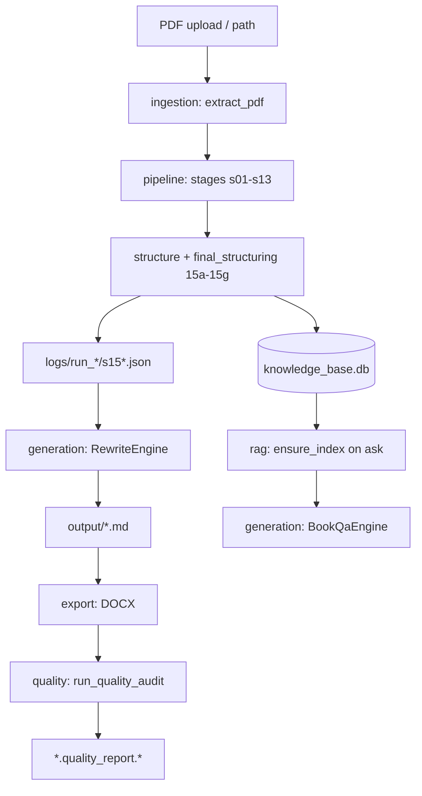

# Engine Code Reference — Index

> **Role:** Exhaustive file and public-symbol inventory with **purpose** and **why**.  
> **Authority:** Per-symbol detail lives here; module specs (`specs/modules/`) summarize flows and link here.  
> **Rule:** See `.cursor/rules/13-comprehensive-spec-documentation.mdc`

---

## How to read

Each package doc uses tables:

| Symbol | Purpose | Why it exists | Called by |
|--------|---------|---------------|-----------|

**Status:** `Implemented` unless marked `Partial`, `Planned`, or `Deprecated`.

---

## Package reference files

| Doc | Code path | Pipeline stages |
|-----|-----------|-----------------|
| [pipeline.md](./pipeline.md) | `backend/src/modules/pipeline/` | s01–s13 orchestration |
| [structure.md](./structure.md) | `backend/src/modules/structure/` | Heading detection, 15a–16 |
| [generation.md](./generation.md) | `backend/src/modules/generation/` | Rewrite, Q&A, prompts |
| [quality.md](./quality.md) | `backend/src/modules/quality/` | Post-export audit |
| [export.md](./export.md) | `backend/src/modules/export/` | MD/DOCX assembly |
| [rag.md](./rag.md) | `backend/src/modules/rag/` | FAISS hybrid retrieval |
| [ingestion.md](./ingestion.md) | `backend/src/modules/ingestion/` | PDF → lines |
| [interaction.md](./interaction.md) | `backend/src/modules/interaction/` | CLI intent + handlers |
| [services-scripts.md](./services-scripts.md) | `backend/services/`, `backend/scripts/` | Web layer + batch tools |

---

## End-to-end data flow



---

## Final structuring order (authoritative)

From `final_structuring_stage.py`:

```text
15a heading hierarchy
→ 15d ultimate sections
→ 15e chapter hierarchy
→ 15f heading cleanup
→ 15h chapter placement
→ 15i heading refinement
→ 15j OpenAI hierarchy refinement
→ 15g title validation
→ 15c final book
→ 16 RAG snapshot
```

`enforce_chapter_structure()` runs at end of **15h** (via placement), **15i**, **15j**, **15g**, and again when **rewrite** loads hierarchy — prevents mega-chapter collapse and statute-prose titles in export.

---

## Related specs

| Topic | Spec |
|-------|------|
| Module summaries | [../modules/](../modules/) |
| Architecture | [../architecture.md](../architecture.md) |
| Config / env | [../modules/parameters-config.md](../modules/parameters-config.md) |
| Tests | [../testing.md](../testing.md) |
| Changes | [../change-log.md](../change-log.md) |
