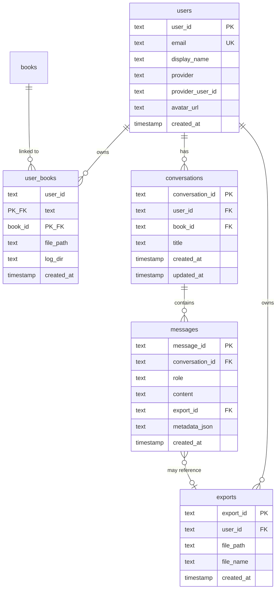

# Data Models — AI Notes Creator Model

> **Role:** Authoritative for all entities and SQLite schemas (MESO Rule 8).  
> **Not here:** Repository usage → [modules/storage.md](./modules/storage.md) · API response shapes → [backend-api.md](./backend-api.md) §5

---

## 1. Pipeline Entities

**Code:** `backend/src/shared/models.py`

### `NormalizedLine`

One text line after PDF extraction and normalization.

| Field | Type | Notes |
|-------|------|-------|
| `line_id` | int | Stable line index |
| `text` | str | Line content |
| `page_number` | int \| None | Source page |
| `y_pos`, `font_size`, `x0`, `x1`, `y0`, `y1`, `x_center` | float | Layout |
| `is_bold`, `is_italic`, `is_upper`, `is_centered` | bool | Typography flags |
| `is_noise`, `noise_type` | bool, str | Noise filter output |
| `before_context`, `after_context` | str | Context windows |
| `source` | str | `""`, `"table"`, `"image_ocr"` |

### `HeadingCandidate`

Pre-final heading proposal from candidate scoring.

| Field | Type | Notes |
|-------|------|-------|
| `id` | str | Candidate identifier |
| `text` | str | Heading text |
| `start_line`, `end_line` | int | Line span |
| `confidence` | float | Score |
| `is_valid`, `valid_reason` | bool, str | Gate output |
| `line_id`, `source_line_id` | int \| None | Line linkage |

### `FinalHeading`

Heading after continuity and TOC passes.

| Field | Type | Notes |
|-------|------|-------|
| `id` | str | Final heading id |
| `text` | str | Heading text |
| `line_id` | int | Source line |
| `fragment_id` | str \| None | Assigned fragment |
| `level` | int | Hierarchy level |
| `is_toc`, `in_toc_section` | bool | TOC flags |
| `page_number` | int \| None | Page |

### `Fragment`

Text block between headings.

| Field | Type | Notes |
|-------|------|-------|
| `id` / `fragment_id` | str | Fragment identifier |
| `start_line`, `end_line` | int | Line span |
| `assigned_heading_id` | str | Primary heading |
| `text` | str | Fragment body |

### `PipelineResult`

| Field | Type |
|-------|------|
| `final_headings` | list[FinalHeading] |
| `fragments` | list[Fragment] |
| `heading_to_fragment_id` | dict[str, str] |

### `IntentResult`

Parsed user intent from `CommandParser`.

| Field | Type | Values |
|-------|------|--------|
| `task_type` | str | `rewrite_book`, `study_notes`, `revision_notes`, `summarize_book`, `question_answer` |
| `scope` | str | `full_book`, `single_question` |
| `depth` | str | `very_short`, `short`, `medium`, `long` |
| `language_level` | str | `simple`, `standard`, `academic` |
| `format_type` | str | `paragraph`, `bullet`, `exam_oriented` |
| `allow_external_knowledge` | bool | Q&A domain guard |
| `normalized_query` | str | Cleaned user text |

---

## 2. Knowledge Store Schema

**Code:** `backend/src/modules/storage/knowledge_store.py`, `schema.py`  
**Database:** `output/knowledge_base.db`

### `books`

| Column | Type | Notes |
|--------|------|-------|
| `book_id` | TEXT PK | UUID |
| `title` | TEXT | Book title |
| `subject` | TEXT | Subject area |
| `source_file_name` | TEXT | Original PDF name |
| `total_pages` | INTEGER | Page count |
| `processed_at` | TIMESTAMP | Ingestion time |

### `final_headings`

| Column | Type | Notes |
|--------|------|-------|
| `heading_id` | TEXT PK | Heading identifier |
| `book_id` | TEXT FK | Parent book |
| `text` | TEXT | Heading text |
| `level` | INTEGER | Hierarchy level |
| `page_number` | INTEGER | Source page |
| `line_id` | INTEGER | Source line |
| `parent_id` | TEXT | Parent heading |
| `fragment_id` | TEXT | Linked fragment |

### `fragments`

| Column | Type | Notes |
|--------|------|-------|
| `fragment_id` | TEXT PK | Fragment identifier |
| `book_id` | TEXT FK | Parent book |
| `text` | TEXT | Fragment body |
| `start_line`, `end_line` | INTEGER | Line span |
| `assigned_heading_id` | TEXT | Primary heading |

### `heading_fragments`

Many-to-many heading ↔ fragment links.

### `rag_chunks` + `rag_index_meta`

RAG vector index metadata per book. See [modules/rag-retrieval.md](./modules/rag-retrieval.md).

### Pydantic Models (`schema.py`)

| Model | Purpose |
|-------|---------|
| `BookMetadata` | Book-level metadata for persistence |
| `TopicKnowledge` | Topic/chapter knowledge records (legacy, largely unused) |

---

## 3. Platform Store Schema

**Code:** `backend/storage/user_repository.py`  
**Database:** Same `output/knowledge_base.db` (extends knowledge store)



### `users`

| Column | Type | Notes |
|--------|------|-------|
| `user_id` | TEXT PK | UUID |
| `email` | TEXT UNIQUE | User email |
| `display_name` | TEXT | Display name |
| `provider` | TEXT | `google` \| `apple` \| `facebook` \| `guest` |
| `provider_user_id` | TEXT | OAuth provider ID |
| `avatar_url` | TEXT | Profile image URL |
| `created_at` | TIMESTAMP | Registration time |

**Unique index:** `(provider, provider_user_id)`

### `user_books`

Links users to ingested books. Stores paths for rewrite/Q&A context.

| Column | Type | Notes |
|--------|------|-------|
| `user_id` | TEXT PK (composite) | Owner |
| `book_id` | TEXT PK (composite) | Book reference |
| `file_path` | TEXT | Path to uploaded PDF |
| `log_dir` | TEXT | Pipeline log directory (`logs/run_*`) |

### `conversations`

Chat threads, one per book (user can have multiple).

| Column | Type | Notes |
|--------|------|-------|
| `conversation_id` | TEXT PK | UUID |
| `user_id` | TEXT FK | Owner |
| `book_id` | TEXT FK | Associated book |
| `title` | TEXT | Auto-generated from first message |
| `created_at`, `updated_at` | TIMESTAMP | Timestamps |

### `messages`

| Column | Type | Notes |
|--------|------|-------|
| `message_id` | TEXT PK | UUID |
| `conversation_id` | TEXT FK | Parent conversation |
| `role` | TEXT | `user` \| `assistant` |
| `content` | TEXT | Message body (markdown for assistant) |
| `export_id` | TEXT FK | Linked Word export (nullable) |
| `metadata_json` | TEXT | JSON: intent, docx_url, sources |
| `created_at` | TIMESTAMP | Message time |

**Message metadata shape:**

```json
{
  "intent": "question_answer",
  "task_type": "question_answer",
  "docx_available": true,
  "docx_download_url": "/api/exports/uuid",
  "export_reason": "qa_length"
}
```

### `exports`

Generated Word files for secure download.

| Column | Type | Notes |
|--------|------|-------|
| `export_id` | TEXT PK | UUID |
| `user_id` | TEXT FK | Owner (for access control) |
| `file_path` | TEXT | Absolute path on disk |
| `file_name` | TEXT | Display filename |
| `created_at` | TIMESTAMP | Generation time |

---

## 4. Platform Dataclasses

**Code:** `backend/storage/user_repository.py`

```python
@dataclass
class UserRecord:
    user_id: str
    email: str
    display_name: str
    provider: str
    provider_user_id: str
    avatar_url: str | None = None

@dataclass
class ConversationRecord:
    conversation_id: str
    user_id: str
    book_id: str
    title: str
    created_at: str
    updated_at: str

@dataclass
class MessageRecord:
    message_id: str
    conversation_id: str
    role: str
    content: str
    export_id: str | None
    metadata: dict[str, Any]
    created_at: str

@dataclass
class ExportRecord:
    export_id: str
    user_id: str
    file_path: str
    file_name: str
    created_at: str
```

---

## 5. API Response Models

**Code:** `backend/api/schemas.py`

See [backend-api.md](./backend-api.md) §5 for full Pydantic schema definitions:
- `UserProfile`, `BookSummary`, `ConversationSummary`, `MessageResponse`, `ChatReplyResponse`
- `UploadJobResponse`, `UploadStatusResponse`, `CreateConversationRequest`, `SendMessageRequest`

---

## 6. File System Models

| Path Pattern | Entity | Owner |
|--------------|--------|-------|
| `{UPLOADS_FOLDER}/{user_id}/{filename}.pdf` | Uploaded PDF | User |
| `{EXPORTS_FOLDER}/{user_id}/{title}.docx` | Generated Word | User |
| `{RAG_INDEX_DIR}/{book_id}/` | FAISS index + meta | Book |
| `{LOGS_FOLDER}/run_{timestamp}/s*.json` | Pipeline stage JSON | Book (via `user_books.log_dir`) |
| `{KNOWLEDGE_DB_PATH}` | SQLite database | System |

All constants defined in `shared/config.py` relative to `PROJECT_ROOT`. Legacy run folders may use pre-rename filenames (`01_layout_lines.json`, `15d_ultimate_sections.json`); code reads via `resolve_existing_artifact()`.

---

## 7. Naming Conventions

| Entity | Convention | Example |
|--------|------------|---------|
| Python classes | `PascalCase` | `NormalizedLine`, `UserRecord` |
| Fields | `snake_case` | `book_id`, `created_at` |
| Heading IDs | String from line ids | `h_1234` |
| Fragment IDs | `frag_<n>` | `frag_42` |
| Log stages | Canonical JSON via `stage_registry` | `s05_fragments.json` |
| Log keys | Semantic keys for `write_stage` | `fragments`, `15d_ultimate_sections` |
| UUIDs | `uuid4()` string | `13cbacf8-9a50-44cc-944c-8989b71f38ed` |

---

## 8. Schema Migration Policy

- **Platform tables:** `CREATE TABLE IF NOT EXISTS` + `ALTER TABLE` for new columns
- **RAG tables:** `RagRepository` detects legacy schema and recreates (see change-log 2026-05-31)
- **Breaking changes:** Document in `change-log.md`, update this spec first
