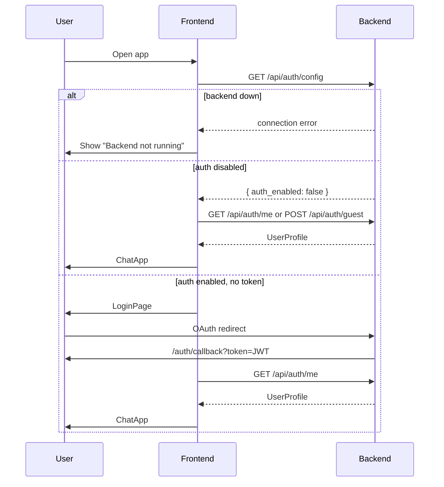
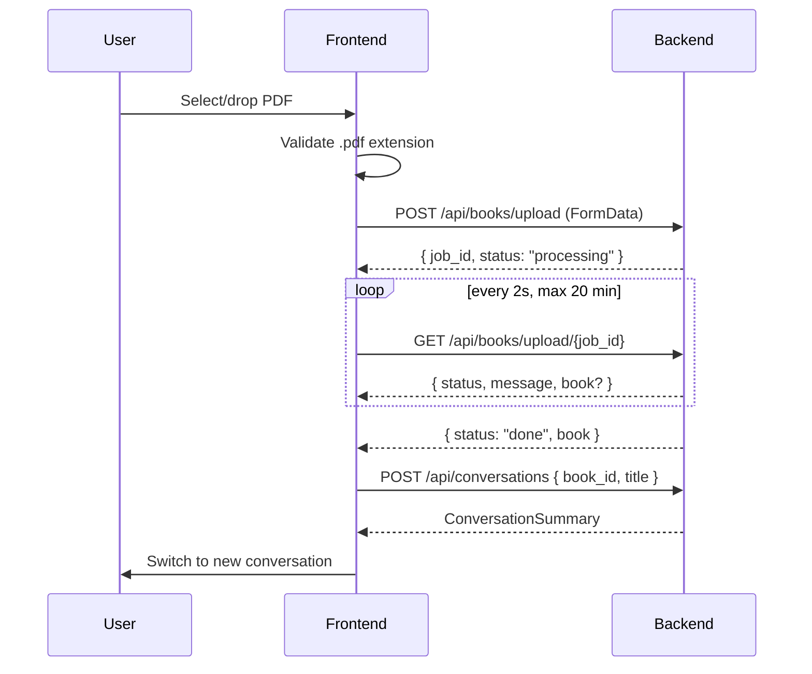
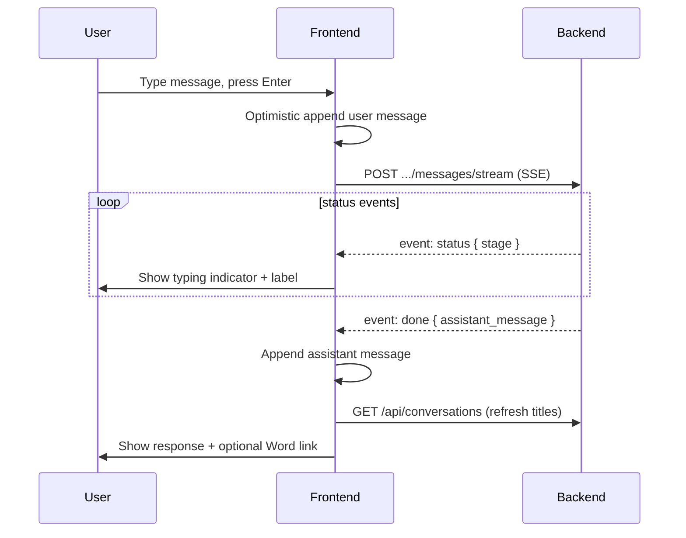

# Frontend Specification — InsightEngine Web UI

> **Role:** Authoritative for React UI (components, state, flows).  
> **Not here:** Requirement IDs → [requirements-web-platform.md](./requirements-web-platform.md) · API contracts → [ui-backend-integration.md](./ui-backend-integration.md) · Endpoints → [backend-api.md](./backend-api.md)  
> **Code:** `frontend/` · **Stack:** React 18 + TypeScript + Vite 5

---

## 1. Purpose

The frontend is a single-page chat application that wraps the backend PDF-to-notes engine. Users authenticate (or use guest mode), upload PDF books, converse with AI about book content, and download Word exports when the backend produces them.

**Design principle:** The frontend is a **thin presentation layer**. All business logic (intent routing, rewrite, Q&A, export policy) lives in the backend.

---

## 2. File Structure

```
frontend/
├── index.html                 # Entry HTML, DM Sans font, #root mount
├── package.json               # Dependencies & scripts
├── vite.config.ts             # Dev server :5173, /api proxy → :8000
├── tsconfig.json              # Strict TS; include: ["src"] only
├── Dockerfile                 # node:20-alpine, npm run dev --host
├── auth/                      # Auth layer (bundled by Vite, outside tsconfig)
│   ├── api.ts                 # All HTTP/SSE calls, types, token helpers
│   ├── AuthProvider.tsx       # React Context for auth state
│   ├── LoginPage.tsx          # Login / skip-auth / backend-down UI
│   └── AuthCallbackPage.tsx   # OAuth token callback handler
└── src/
    ├── main.tsx               # Root mount, pathname routing
    ├── App.tsx                # ChatApp — main application logic
    ├── styles.css             # Global dark-theme CSS (~566 lines)
    ├── vite-env.d.ts          # Vite client types
    └── components/
        ├── Sidebar.tsx        # Sidebar + WelcomePanel
        └── MessageBubble.tsx  # Chat message rendering + Word download
```

---

## 3. Component Hierarchy

```mermaid
flowchart TD
    subgraph main["main.tsx"]
        SM[StrictMode]
        SM --> Root{pathname?}
        Root -->|/auth/callback| ACP[AuthCallbackPage]
        Root -->|else| AR[AppRouter]
        ACP --> AP1[AuthProvider]
        AR --> AP2[AuthProvider]
        AP2 --> ARouter{user?}
        ARouter -->|loading| LC[Loading card]
        ARouter -->|!user| LP[LoginPage]
        ARouter -->|user| CA[ChatApp]
    end

    subgraph chat["ChatApp (App.tsx)"]
        CA --> SB[Sidebar]
        CA --> MAIN[chat-main]
        MAIN --> HDR[chat-header]
        MAIN --> MSG[messages-panel]
        MAIN --> ERR[error-banner]
        MAIN --> UPL[upload-progress]
        MAIN --> CMP[composer]
        MSG --> WP[WelcomePanel]
        MSG --> MB[MessageBubble[]]
        MSG --> TI[typing-indicator]
    end
```

### Component Responsibilities

| Component | File | Responsibility |
|-----------|------|----------------|
| `AuthProvider` | `auth/AuthProvider.tsx` | Bootstrap auth, expose `useAuth()` hook |
| `LoginPage` | `auth/LoginPage.tsx` | OAuth links, "Continue as guest" (when `allowGuest`), backend-down error |
| `AuthCallbackPage` | `auth/AuthCallbackPage.tsx` | Parse `?token=` from OAuth redirect |
| `ChatApp` | `src/App.tsx` | Books, conversations, messages, upload, send |
| `Sidebar` | `src/components/Sidebar.tsx` | Nav: upload, new chat, conversation list |
| `WelcomePanel` | `src/components/Sidebar.tsx` | Empty-state onboarding with drag-drop |
| `MessageBubble` | `src/components/MessageBubble.tsx` | Markdown render + authenticated Word download button |

---

## 4. Routing

No React Router. Pathname-based routing in `main.tsx`:

| Path | Component | Condition |
|------|-----------|-----------|
| `/` | `LoginPage` or `ChatApp` | Based on auth state |
| `/auth/callback` | `AuthCallbackPage` | OAuth redirect with `?token=` |

**Gap (future):** No deep links to specific conversations. Adding React Router would enable `/chat/{conversation_id}`.

---

## 5. State Management

All state is **local React state** + one **React Context** for auth. No Redux, Zustand, or TanStack Query.

### Auth Context (`AuthProvider`)

| State | Type | Purpose |
|-------|------|---------|
| `user` | `UserProfile \| null` | Current user |
| `loading` | `boolean` | Initial auth bootstrap |
| `authEnabled` | `boolean` | From `/api/auth/config` |
| `allowGuest` | `boolean` | From `/api/auth/config` — controls "Continue as guest" button |
| `backendOk` | `boolean` | Backend reachable |
| `skipAuth` | `boolean` | User chose guest mode |

**Exposed methods:** `loginWithToken`, `enterWithoutAuth`, `logout`, `refreshUser`, `setSkipAuth`

`enterWithoutAuth` calls `POST /api/auth/guest`; if the response includes a `token`
(when `AUTH_ENABLED=true`), it is stored as the Bearer JWT so the guest gets an
isolated, persisted session. When auth is disabled, the response has no token and
the shared dev identity is used.

### ChatApp Local State

| State | Purpose |
|-------|---------|
| `books` | Uploaded PDF books |
| `conversations` | Chat threads |
| `activeConvId` | Selected conversation |
| `messages` | Messages in active conversation |
| `input` | Composer textarea |
| `sending` | Message in flight |
| `statusText` | SSE stage label during send |
| `uploading` / `uploadStatus` | PDF upload + polling progress |
| `error` | Error banner text |

### Persistence (localStorage)

| Key | Purpose |
|-----|---------|
| `auth_token` | JWT Bearer token |
| `skip_auth` (`"1"`) | Skip-login preference |

---

## 6. API Integration

Base URL: `${VITE_API_BASE || ""}` + path. Auth via `Authorization: Bearer <token>`.

### HTTP Helpers (`auth/api.ts`)

```typescript
// Generic JSON fetch with auth header
export async function apiFetch<T>(path: string, options?: RequestInit): Promise<T>

// OAuth redirect URL builder
export function oauthLoginUrl(provider: "google" | "apple" | "facebook"): string

// SSE chat stream parser
export async function sendMessageStream(
  conversationId: string,
  content: string,
  onStatus: (s: { stage: string; detail?: string }) => void
): Promise<ChatStreamResult>

// Async upload with polling
export async function uploadBookWithProgress(
  file: File,
  onProgress: (message: string) => void
): Promise<BookSummary>

// Authenticated blob download (sends Bearer token, then triggers browser save).
// Used by MessageBubble for DOCX exports — a plain <a href> cannot send the JWT.
export async function downloadFile(path: string, suggestedName?: string): Promise<void>
```

### Endpoints Called

| Method | Endpoint | Called From | Purpose |
|--------|----------|-------------|---------|
| GET | `/api/auth/config` | `AuthProvider.refreshUser` | Auth enabled, backend health |
| GET | `/api/auth/me` | `AuthProvider.refreshUser` | Current user profile |
| POST | `/api/auth/guest` | `AuthProvider.enterWithoutAuth` | Guest session |
| GET | `/api/auth/{provider}/login` | `LoginPage` | OAuth redirect |
| GET | `/api/books` | `ChatApp.loadBooks` | List books |
| POST | `/api/books/upload` | `uploadBookWithProgress` | Start async upload |
| GET | `/api/books/upload/{job_id}` | `uploadBookWithProgress` | Poll job status |
| GET | `/api/conversations` | `ChatApp.loadConversations` | List conversations |
| POST | `/api/conversations` | `handleUpload`, `handleNewChat` | Create conversation |
| GET | `/api/conversations/{id}/messages` | `ChatApp.loadMessages` | Message history |
| POST | `/api/conversations/{id}/messages/stream` | `sendMessageStream` | SSE chat |

### SSE Event Protocol

| Event | Payload | UI Effect |
|-------|---------|-----------|
| `status` | `{ stage, detail }` | Typing indicator + status label |
| `error` | `{ detail }` | Error banner |
| `done` | `ChatStreamResult` JSON | Append assistant message |

**Status stage labels** (mapped in `STATUS_LABELS`):

| Stage | User-facing label |
|-------|-------------------|
| `received` | Received your message |
| `parsing_intent` | Understanding your request |
| `answering_question` | Searching the book and drafting answer |
| `rewriting_book` | Rewriting full book notes |
| `exporting_word` | Generating Word document |
| `preparing_word` | Preparing Word download |
| `done` | Done |

---

## 7. User Flows

### Flow 1: Authentication Bootstrap



### Flow 2: PDF Upload



### Flow 3: Send Chat Message



### Flow 4: Word Download

No separate export UI. Driven entirely by backend chat intent:

1. Backend sets `assistant_message.metadata.docx_download_url`
2. `MessageBubble` renders a download button when URL present; clicking calls
   `downloadFile` (authenticated blob fetch + save), surfacing `.download-error`
   text on failure — works for OAuth users and token-authed guests alike
3. Link points to `GET /api/exports/{export_id}` (authenticated)

---

## 8. UI Layout & Styling

- **Layout:** CSS Grid `300px` sidebar + `1fr` main (`app-shell`)
- **Theme:** Dark via CSS variables (`--bg`, `--accent`, `--text`, etc.)
- **Font:** DM Sans (Google Fonts)
- **Responsive:** Breakpoint `900px` — sidebar stacks above main
- **Markdown:** `react-markdown` for assistant messages only

### Key CSS Classes

| Class | Purpose |
|-------|---------|
| `app-shell` | Grid layout container |
| `sidebar` | Left navigation panel |
| `chat-main` | Main chat area |
| `messages-panel` | Scrollable message list |
| `message-bubble` | Individual message |
| `message-bubble.user` | User message (right-aligned) |
| `message-bubble.assistant` | Assistant message (markdown) |
| `composer` | Message input area |
| `typing-indicator` | Animated dots during SSE |
| `error-banner` | Red error display |
| `upload-progress-banner` | Upload status display |

---

## 9. Environment & Dev Setup

| Variable | Default | Purpose |
|----------|---------|---------|
| `VITE_API_BASE` | `""` | API base URL (empty = same origin / Vite proxy) |

**Vite proxy** (`vite.config.ts`):

```typescript
server: {
  port: 5173,
  proxy: { "/api": "http://localhost:8000" }
}
```

**Scripts:**

```bash
npm install      # Install dependencies
npm run dev      # Dev server on :5173
npm run build    # Production build to dist/
npm run preview  # Preview production build
```

---

## 10. Known Gaps & Future Improvements

| Gap | Impact | Suggested Fix |
|-----|--------|---------------|
| No React Router | No deep links to conversations | Add `react-router-dom`, route `/chat/:id` |
| No conversation delete/rename | Users cannot manage history | Add API endpoints + sidebar actions |
| New chat always uses `books[0]` | Multi-book users cannot pick book | Add book selector dropdown |
| No token streaming | Full response appears at once | Backend SSE token events + frontend incremental render |
| `auth/` outside tsconfig | IDE may not type-check auth files | Extend `tsconfig.json` include |
| Dockerfile runs dev server | Not production-ready | Multi-stage build with nginx static serve |
| No offline/error retry | Network blips lose state | Add retry logic in `apiFetch` |

---

## 11. Modification Guide (Frontend)

When changing the frontend:

1. **Read** `specs/frontend.md` and `specs/ui-backend-integration.md` first
2. **API changes** — update `auth/api.ts` types and functions; sync `specs/backend-api.md`
3. **New UI feature** — add component under `src/components/`, wire in `App.tsx`
4. **Auth changes** — update `AuthProvider.tsx` + `specs/requirements-web-platform.md` §3.1
5. **Styling** — extend `styles.css` variables; avoid inline styles
6. **No business logic** — intent routing, export policy, rewrite logic stay in backend

### Adding a New API Call

```typescript
// 1. Add type in auth/api.ts
export interface MyResponse { field: string }

// 2. Add fetch function
export async function myApiCall(id: string): Promise<MyResponse> {
  return apiFetch<MyResponse>(`/api/my-endpoint/${id}`);
}

// 3. Use in component with error handling
try {
  const data = await myApiCall("123");
} catch (e) {
  setError(e instanceof Error ? e.message : "Failed");
}
```

### Adding a New UI Component

```
src/components/MyComponent.tsx   # Component
src/styles.css                     # Add scoped class (e.g. .my-component)
src/App.tsx                        # Import and render
specs/frontend.md                  # Document in §3 hierarchy
```
