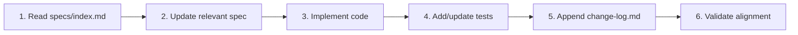
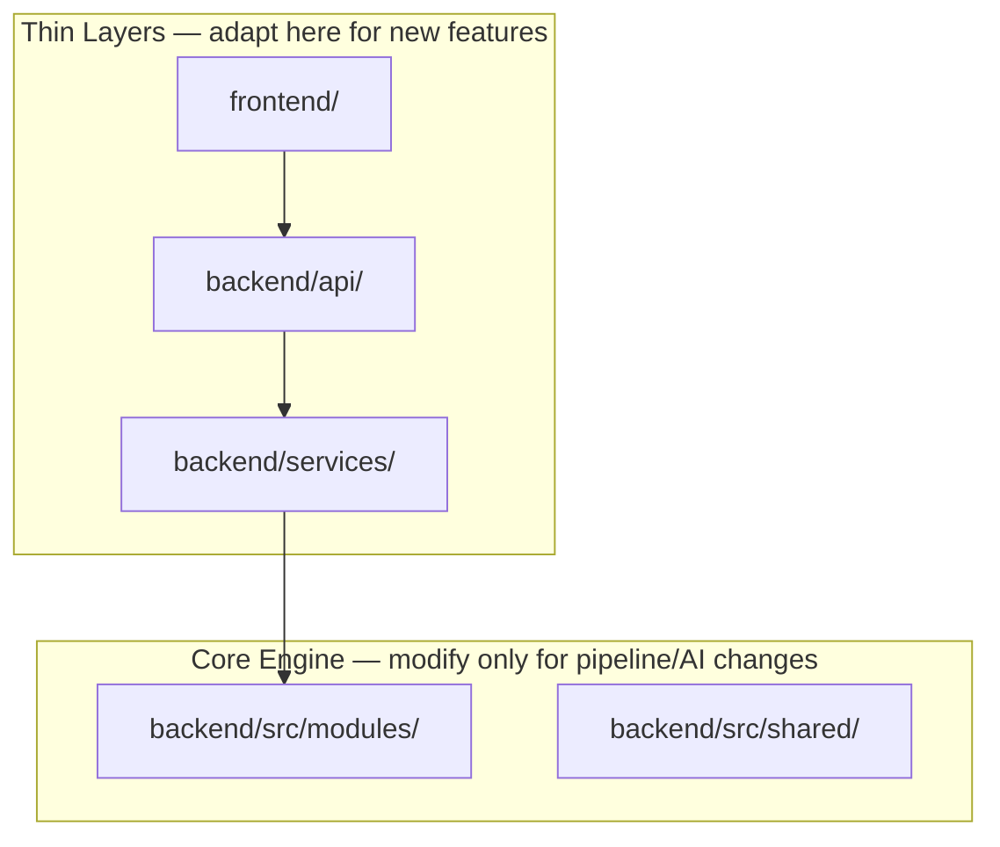

# Future Modifications Guide

> **Status:** ACTIVE  
> **Version:** 1.0  
> **Date:** 2026-06-07  
> **Purpose:** Best practices for extending and modifying the AI Notes Creator system

---

## 1. MESO Workflow (Mandatory)

Every change follows this order:



**Rule:** Spec leads code. Never implement first and document later.

---

## 2. Layer Boundaries



| Change Type | Where to Modify | Spec to Update |
|-------------|-----------------|----------------|
| New UI button/page | `frontend/src/` | `frontend.md` |
| New API endpoint | `backend/api/routes/` | `backend-api.md` |
| New chat behavior | `backend/services/chat_service.py` | `backend-api.md`, `requirements-web-platform.md` |
| Export policy change | `backend/services/export_policy.py` | `modules/export.md` §3 + `requirements-web-platform.md` §2.4 |
| New pipeline stage | `backend/src/modules/pipeline/stages.py` | `modules/pipeline-core.md` |
| New LLM feature | `backend/src/modules/generation/` | `modules/llm-generation.md` |
| New config key | `config/default.yaml`, `src/shared/config.py` | `modules/parameters-config.md`, `.env.example` |
| Database schema | `storage/user_repository.py` or `src/modules/storage/` | `data-models.md` |

---

## 3. Common Modification Scenarios

### 3.1 Add a New Chat Intent

**Example:** "Generate flashcards from chapter X"

```
1. specs/modules/cli-interaction.md — document new intent
2. backend/src/modules/interaction/command_parser.py — add detection pattern
3. backend/src/modules/interaction/handlers/ — add or extend handler
4. backend/services/chat_service.py — route to new handler
5. backend/tests/unit/test_llm_and_parser.py — test intent detection
6. specs/change-log.md — append entry
```

```python
# command_parser.py — add pattern
FLASHCARD_PATTERNS = (r"\bflashcard", r"\bquiz me\b")

# In parse_intent():
if _matches_any(lowered, FLASHCARD_PATTERNS):
    return IntentResult(task_type="flashcards", ...)
```

### 3.2 Add a New API Endpoint

```
1. specs/backend-api.md §4 — document endpoint
2. backend/api/schemas.py — request/response models
3. backend/services/ — business logic
4. backend/api/routes/ — thin route handler
5. backend/api/main.py — register router
6. frontend/auth/api.ts — client function + types
7. frontend/src/App.tsx — wire UI
8. specs/ui-backend-integration.md — document contract
9. backend/tests/api/ — route tests (recommended)
```

### 3.3 Add a New Pipeline Stage

```
1. specs/modules/pipeline-core.md — document stage order
2. backend/src/modules/pipeline/stage_registry.py — add log key + canonical filename
3. backend/src/modules/pipeline/stages.py — add stage function + STAGES entry
4. backend/src/modules/pipeline/context.py — add context fields if needed
5. backend/tests/integration/test_logging_contract.py — add expected JSON file
6. specs/modules/logging-debug.md — document log artifact name
```

```python
# stage_registry.py — register before writing logs
STAGE_LOG_FILES["my_new_stage"] = "s13_my_new_stage.json"  # next free sNN

# stages.py
def stage_my_new_stage(ctx: PipelineContext) -> None:
    result = my_processing(ctx.lines)
    ctx.my_result = result
    ctx.logger.write_stage("my_new_stage", result)
```

**Reading artifacts in services:** use `resolve_existing_artifact(log_dir, "my_new_stage")` — never hardcode paths.

### 3.4 Add a New OAuth Provider

```
1. specs/requirements-web-platform.md §2.1 — add AUTH-* requirement
2. backend/auth/providers/oauth_providers.py — implement provider
3. backend/auth/config.py — add config fields
4. .env.example — add env vars
5. backend/api/routes/auth.py — provider already generic via {provider}
6. frontend/auth/LoginPage.tsx — add button
7. specs/backend-api.md §4.2 — document
```

### 3.5 Change Export Policy

```
1. specs/requirements-web-platform.md §2.4 — update EXP-* requirement IDs
2. specs/modules/export.md §3 — update implementation rules
3. backend/services/export_policy.py — implement logic
4. backend/tests/unit/test_export_policy.py — add test cases
```

### 3.6 Add Frontend Feature

```
1. specs/frontend.md — document component/flow
2. frontend/src/components/ — new component
3. frontend/src/styles.css — styles
4. frontend/src/App.tsx — wire state and handlers
5. frontend/auth/api.ts — API calls if needed
6. specs/ui-backend-integration.md — if new API contract
```

---

## 4. Import Policy

**Always use canonical paths:**

```python
# CORRECT
from src.modules.pipeline.runner import run_pipeline
from src.modules.interaction.command_parser import CommandParser
from src.shared.config import OUTPUT_FOLDER
from src.shared.models import NormalizedLine

# WRONG — legacy shims (removed 2026-06-01)
from src.core.pipeline import run_pipeline
from src.interaction.command_parser import CommandParser
```

**Web layer imports:**

```python
# backend/api/ and backend/services/
from auth.dependencies import get_current_user
from services.chat_service import ChatService
from storage.user_repository import ConversationRepository
```

---

## 5. Configuration Policy

New tunables MUST be added in this order:

1. `specs/modules/parameters-config.md` — document key
2. `backend/config/default.yaml` — default value
3. `backend/src/shared/config.py` — loader (if pipeline key)
4. `backend/auth/config.py` — loader (if web platform key)
5. `.env.example` — example value with comment
6. Code — read via config, never hardcode

```python
# WRONG
if len(answer) > 4000:

# CORRECT
from auth.config import get_auth_settings
limit = get_auth_settings().chat_docx_char_limit
if len(answer) > limit:
```

---

## 6. Database Changes

### Platform tables (`backend/storage/user_repository.py`)

```python
# Add column with migration-safe DDL
cur.execute("ALTER TABLE conversations ADD COLUMN pinned INTEGER DEFAULT 0")
```

### Knowledge tables (`backend/src/modules/storage/knowledge_store.py`)

```python
# Schema changes need RagRepository migration logic if breaking
# See rag_repository.py for pattern: detect old schema, drop, recreate
```

**Always update:** `specs/data-models.md`

---

## 7. Testing Requirements

| Change | Minimum Tests |
|--------|---------------|
| New function | Unit test in `tests/unit/` |
| Changed export policy | Update `test_export_policy.py` |
| New pipeline stage | Update `test_logging_contract.py` |
| New API endpoint | `TestClient` test (recommended) |
| Bug fix | Regression test proving fix |

```bash
# Before committing
cd backend && pytest tests/unit -v
```

---

## 8. Approved Backlog (from SDD)

| Item | Priority | Spec to Update |
|------|----------|----------------|
| API route tests | High | `testing.md` §10 |
| React Router for deep links | Medium | `frontend.md` §4 |
| Book picker for multi-book users | Medium | `frontend.md` §10 |
| Upload job persistence (Redis/DB) | Medium | `backend-api.md` §6.4 |
| PostgreSQL migration option | Low | `data-models.md`, `requirements-web-platform.md` |
| Token streaming in chat | Low | `ui-backend-integration.md` §4 |
| Apple Sign In production setup | Medium | `requirements-web-platform.md` §4 |
| Conversation delete/rename | Low | `frontend.md`, `backend-api.md` |

---

## 9. Anti-Patterns to Avoid

| Anti-Pattern | Why Bad | Do Instead |
|--------------|---------|------------|
| Business logic in API routes | Untestable, duplicated | Move to `services/` |
| Hardcoded config values | Can't tune without code change | Use `config/default.yaml` + env |
| Direct DB access from routes | Bypasses repository layer | Use `storage/` repositories |
| Frontend intent parsing | Duplicates backend logic | Send raw text, let backend parse |
| Skipping spec update | Drift between docs and code | Update spec FIRST |
| Legacy import paths | May break on cleanup | Use `src.modules.*` |
| Empty commits to specs | Noise | Only commit meaningful doc updates |

---

## 10. File Quick Reference

| I want to... | Authoritative spec |
|--------------|-------------------|
| Navigate all specs | `specs/index.md` |
| Understand system | `specs/architecture.md` |
| Web requirements (IDs) | `specs/requirements-web-platform.md` |
| Add API endpoint | `specs/backend-api.md` §11 |
| Change UI | `specs/frontend.md` §11 |
| UI↔API contract | `specs/ui-backend-integration.md` |
| Engine module detail | `specs/modules/<name>.md` |
| Schemas | `specs/data-models.md` |
| Config / env | `specs/modules/parameters-config.md` |
| Tests | `specs/testing.md` |

---

## 11. Deployment Modifications

### Docker

```yaml
# docker-compose.yml — add env vars here
environment:
  AUTH_ENABLED: "true"
  JWT_SECRET: ${JWT_SECRET}
```

### Production Checklist

- [ ] `AUTH_ENABLED=true`
- [ ] `JWT_SECRET` — secure random, not default
- [ ] OAuth provider credentials configured
- [ ] `FRONTEND_URL` — production domain
- [ ] `VITE_API_BASE` — production API URL
- [ ] HTTPS on both frontend and backend
- [ ] CORS `allow_origins` updated for production domain
- [ ] `MAX_UPLOAD_MB` appropriate for server resources
- [ ] Rate limits tuned for expected traffic
