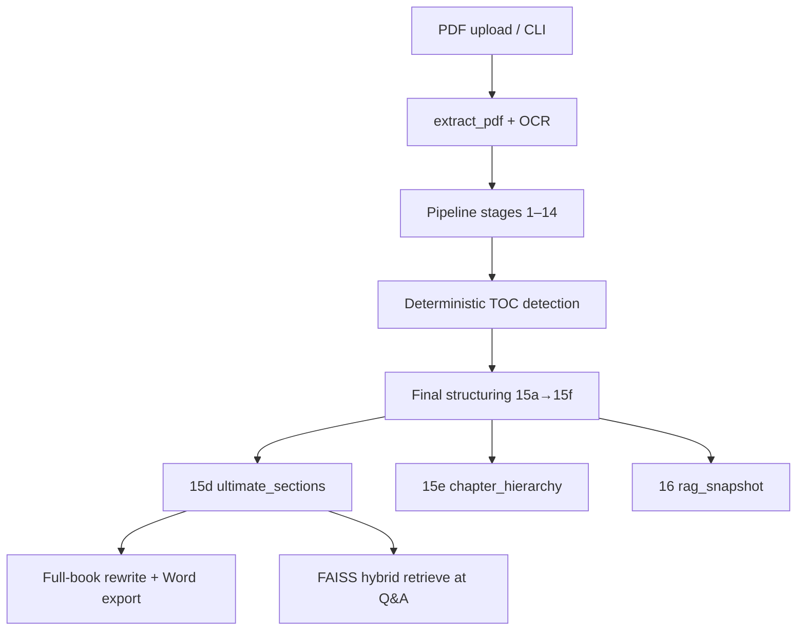
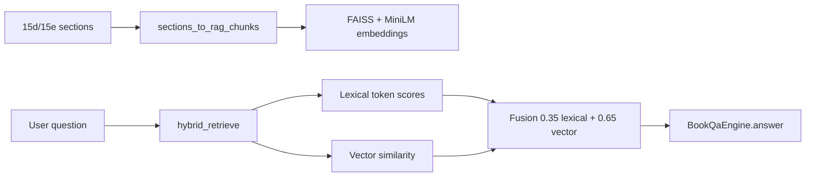
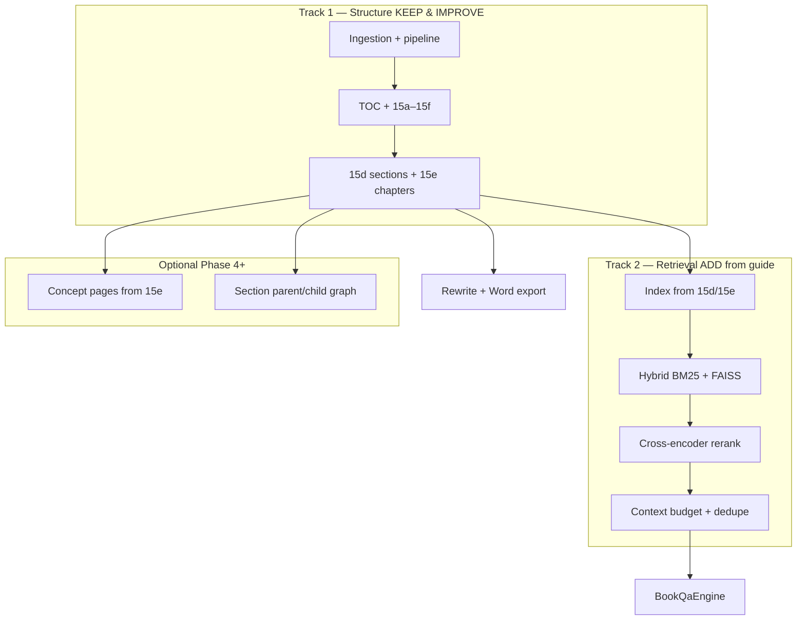

# Ingestion, Dynamic TOC & Advanced RAG Strategy

> **Role:** Architecture analysis — how your current pipeline works, what the Advanced RAG guide adds, and the recommended path forward.  
> **Date:** 2026-06-07  
> **Related:** [modules/ingestion.md](./modules/ingestion.md) · [modules/pipeline-core.md](./modules/pipeline-core.md) · [modules/structure-extraction.md](./modules/structure-extraction.md) · [modules/rag-retrieval.md](./modules/rag-retrieval.md)

---

## 1. Executive Summary

Your system is **structure-first**, not **chunk-first**:

- **Ingestion** extracts PDF lines with layout metadata (optional OCR).
- **Pipeline** detects headings, TOC, and fragments deterministically.
- **Stages 15a–15f** build a **dynamic TOC**, **rewrite-sized sections**, and **chapter hierarchy**.
- **RAG** indexes those sections for Q&A — it does **not** build the book structure.

The **Advanced RAG Knowledge System** guide (cross-encoder reranking, context engineering, OpenKB, RL memory, multimodal graphs) mainly improves **retrieval and answering**. It does **not** replace your ingestion pipeline for building a proper legal textbook TOC.

**Recommended approach:** Keep Track 1 (structure pipeline) and add Track 2 (retrieval upgrades from the guide).

---

## 2. Your Current Pipeline (How It Works)

### 2.1 End-to-end flow



### 2.2 Ingestion layer

| Step | Module | Output |
|------|--------|--------|
| PDF extract | `ingestion/pdf_extractor.py` | PyMuPDF page dicts |
| OCR (optional) | `ingestion/ocr_stage.py` | Synthetic pages for scans / two-up |
| Layout enrich | `ingestion/layout_enrichment.py` | Position, font, typography |
| Normalize | `ingestion/text_normalizer.py` | `NormalizedLine` list |

**Web path:** `services/ingestion_service.py` → `run_pipeline(enable_logs=True)` → `TocRepository.save_full_toc()`

### 2.3 Structure pipeline (stages 1–14)

| Stage | Purpose |
|-------|---------|
| Noise filter | Remove headers/footers |
| Candidate scoring | Score heading candidates |
| Validity gate | LLM/heuristic heading validation |
| Continuity filter | Drop discontinuous headings |
| Fragments | Text blocks between headings |
| Deterministic TOC | Detect repeated TOC patterns |
| Doubted sections (15b) | Resolve late TOC (page > 3) |
| Finalize headings | Strip TOC/metadata rows |

**Authoritative:** [modules/pipeline-core.md](./modules/pipeline-core.md) · [modules/structure-extraction.md](./modules/structure-extraction.md)

### 2.4 Dynamic TOC & sections (stages 15a–15f)

| Stage | Log file | What it builds |
|-------|----------|----------------|
| **15a** | `15a_heading_hierarchy.json` | Heading levels from layout + patterns |
| **15d** | `15d_ultimate_sections.json` | **Rewrite sections** S1, S2, … with subheadings |
| **15e** | `15e_chapter_hierarchy.json` | **Chapter groups** (LLM + rule fallback) |
| **15f** | `15f_heading_cleanup.json` | Weak title cleanup, chapter dedup |
| **15c** | `15c_final_book.json` | Assembled final book |
| **16** | `16_rag_snapshot.json` | RAG-ready section snapshot |

**Code:** `structure/final_structuring/final_structuring_stage.py`

#### How TOC is detected (not from PDF bookmarks)

`toc_repeat_detection.py` uses a **deterministic rule**:

1. Heading text must appear **at least twice** in the document.
2. Next line must also appear twice.
3. Previous line must not look like a numbered outline row.

This finds **printed TOC pages** where headings repeat in the body — not PDF outline/bookmarks.

#### How sections are built (15d)

`build_ultimate_sections()` in `book_assembler.py`:

1. Takes final headings + hierarchy levels.
2. Spans text from each heading to the next.
3. Filters by char thresholds (`ULTIMATE_*` config).
4. Groups small headings as **subheadings** under parent sections.
5. Outputs `section_id` (S1, S2, …), heading, fragment, subheadings.

Sections are sized for **full-book rewrite**, not arbitrary RAG chunk size.

#### How chapters are built (15e)

`chapter_hierarchy_builder.py`:

1. Rule-based: detect CHAPTER, PART, ROMAN numerals, ALL CAPS headings.
2. LLM fallback: assign each section_id to a chapter title.
3. Output: chapter → section mapping for export and navigation.

---

## 3. How RAG Works Today



| Component | File | Notes |
|-----------|------|-------|
| Chunk builder | `rag/chunk_builder.py` | One chunk per section (default) |
| Indexer | `rag/indexer.py` | FAISS + `all-MiniLM-L6-v2` |
| Retriever | `rag/retriever.py` | Hybrid fusion — **no cross-encoder** |
| Service | `rag/service.py` | `ensure_index()`, `retrieve()` |
| Q&A | `generation/qa_engine.py` | RAG if `RAG_ENABLED` + `book_id` |

**Gaps today:**

- `UPLOAD_SKIP_RAG=true` by default — index not built on upload.
- No cross-encoder reranking over candidates.
- No context compression / token budget layer.
- No BM25 index (lexical is inline token overlap only).

---

## 4. What the Advanced RAG Guide Proposes

| Component | Purpose | Helps TOC/sections? | Helps Q&A? |
|-----------|---------|---------------------|------------|
| Hybrid BM25 + dense | Better candidate retrieval | Indirectly | **Yes** |
| Cross-encoder reranking | Precise relevance scoring | No | **Yes — high impact** |
| Context engineering | Dedupe, compress, token budget | No | **Yes** |
| OpenKB / wiki layer | Concept pages, cross-links | Navigation only | Partially |
| RL memory retrieval | Learn which memories to use | No | Chat memory only |
| VimRAG multimodal graphs | Image/video reasoning graphs | No | Multimodal only |
| Docker stack (Ollama, Qdrant, n8n) | Local deployment | No | Infrastructure |

**Key insight:** The guide assumes you already have chunks. Your innovation is **how those chunks are created** (structure pipeline). The guide improves **what happens after**.

---

## 5. Can You Achieve Dynamic TOC + Proper Sections?

### 5.1 With the Advanced RAG guide alone?

| Goal | Possible? |
|------|-----------|
| Dynamic TOC from PDF structure | **No** — RAG does not parse book layout |
| Proper rewrite-sized sections | **No** — flat chunks ≠ chapters |
| Hierarchical Word export | **No** — needs 15d/15e |
| Better Q&A over existing sections | **Yes** |

### 5.2 With your pipeline + selected RAG upgrades?

| Goal | Possible? |
|------|-----------|
| Dynamic TOC | **Yes** — already in 15a–15f |
| Proper sections for rewrite | **Yes** — 15d ultimate sections |
| Better Q&A | **Yes** — add rerank + context layer |
| Wiki-style concept map | **Yes** — optional layer on 15e |

### 5.3 What you would lose by replacing ingestion with pure RAG

- Full-book rewrite with chapter boundaries
- Word `.docx` with hierarchical TOC
- Deterministic, reproducible `logs/run_*/` artifacts
- Legal textbook hierarchy (chapter → section → subheading)
- MESO spec ⇄ code traceability

---

## 6. Strengths & Weaknesses of Current TOC/Sections

### Strengths

1. **Deterministic core** — same PDF → same stage JSON logs.
2. **Layout-aware** — font size, bold, position, noise filter.
3. **TOC from repetition** — works when book has printed TOC pages.
4. **15d sections** — sized for rewrite with parent/child nesting.
5. **15e chapters** — LLM + rule fallback for export.

### Weaknesses

| Problem | Root cause |
|---------|------------|
| No TOC detected | Book lacks repeating heading pattern |
| Bad scans | OCR limits heading quality |
| False headings | Lists, citations scored as headings |
| Late TOC (page > 3) | Doubted sections — 15b helps partially |
| Sections too big/small | Char thresholds, not semantic boundaries |
| Q&A misses right section | No cross-encoder reranking |
| RAG not ready after upload | `UPLOAD_SKIP_RAG=true` |

---

## 7. Recommended Architecture: Two Tracks



### Single source of truth per concern

| Concern | Authoritative location |
|---------|------------------------|
| PDF → lines | `modules/ingestion.md` |
| Heading / TOC detection | `modules/structure-extraction.md` |
| Sections & chapters | `15d` / `15e` logs + `book_assembler.py` |
| RAG index & retrieve | `modules/rag-retrieval.md` |
| Q&A generation | `modules/llm-generation.md` |

---

## 8. Implementation Roadmap

### Phase 1 — Structure track (DONE)

```
PDF → run_pipeline → 15d_ultimate_sections.json → 15e_chapter_hierarchy.json
```

Use for: rewrite, Word export, RAG chunk source.

**Validate:** Open `logs/run_*/15d_ultimate_sections.json` on your hardest PDF.

---

### Phase 2 — Retrieval upgrade (HIGH ROI, LOW RISK)

**Goal:** Better Q&A without changing ingestion.

| Task | File | Detail |
|------|------|--------|
| Add cross-encoder rerank | `rag/retriever.py` | Rerank top 50 hybrid candidates → return top 6–8 |
| Widen candidate pool | `rag/service.py` | Retrieve `top_k * 5` before rerank |
| Enable RAG on upload | `.env` | `UPLOAD_SKIP_RAG=false` |
| Config keys | `parameters-config.md` | `RAG_RERANK_ENABLED`, `RAG_RERANK_MODEL` |

**Suggested reranker:** `cross-encoder/ms-marco-MiniLM-L-6-v2`

```python
# Pseudocode — after hybrid_retrieve
from sentence_transformers import CrossEncoder

reranker = CrossEncoder("cross-encoder/ms-marco-MiniLM-L-6-v2")

def rerank_sections(query: str, candidates: list, top_k: int = 8) -> list:
    pairs = [(query, c["text"]) for c in candidates]
    scores = reranker.predict(pairs)
    ranked = sorted(zip(candidates, scores), key=lambda x: float(x[1]), reverse=True)
    return [{**doc, "rerank_score": float(score)} for doc, score in ranked[:top_k]]
```

**Wire in:** `BookQaEngine._retrieve()` in `qa_engine.py`

---

### Phase 3 — Context engineering layer

**Goal:** Control what the LLM actually sees.

| Task | Detail |
|------|--------|
| Dedupe | Remove overlapping section text before prompt |
| Token budget | Reserve: system → query → top sections → compressed rest |
| Citation pack | Attach `section_id` + heading per evidence block |

**New file:** `modules/rag/context_builder.py`  
**Wire in:** `BookQaEngine.answer()` before LLM call

```python
# Pseudocode
def build_qa_context(query, reranked_sections, max_tokens=12000):
    sections = dedupe_by_overlap(reranked_sections)
    budget = TokenBudget(max_tokens)
    budget.reserve("evidence", sections[:6])  # high-confidence first
    if budget.remaining() > 0:
        budget.reserve("supplemental", compress_extractive(sections[6:], query))
    return budget.render()
```

---

### Phase 4 — Improve dynamic TOC (structure track)

| Task | Where | Benefit |
|------|-------|---------|
| Read PDF outline/bookmarks | `pdf_extractor.py` | TOC when repetition rule fails |
| Semantic section boundaries | `build_ultimate_sections()` | Better than char-only thresholds |
| Section graph from 15e | New `section_graph.py` | Parent/child links for wiki + retrieval |
| OpenKB-style concept pages | New module on 15e output | Broad synthesis questions |

These improve **structure quality** — separate from RAG retrieval.

---

### Phase 5 — Defer unless needed

| Item | When to add |
|------|-------------|
| RL memory retrieval | When you have labeled Q&A feedback data |
| VimRAG multimodal graphs | When figures/diagrams are central to answers |
| Full Docker stack (Qdrant, n8n, SearXNG) | When you need multi-service deployment |
| OpenKB full wiki | When users need browsable concept navigation |

---

## 9. Comparison: Your System vs Advanced RAG Guide

| Layer | Your system today | Advanced RAG guide | Action |
|-------|-------------------|-------------------|--------|
| Ingestion | PDF + OCR + layout | Generic doc loader | **Keep yours** |
| Structure | 15a–15f pipeline | Not covered | **Keep & improve** |
| Index | FAISS on 15d sections | Qdrant + BM25 + graph | **Add BM25 + rerank** |
| Retrieve | Hybrid lexical + vector | Hybrid + cross-encoder | **Add rerank** |
| Context | Simple char limit | Dedupe + compress + budget | **Add context_builder** |
| Memory | Per-conversation (web) | RL long-term memory | Defer |
| Wiki | None | OpenKB concept pages | Optional Phase 4 |
| Multimodal | `visual_elements` log | VimRAG memory graph | Defer |

---

## 10. Evaluation Metrics

Track these when upgrading retrieval:

| Metric | Target |
|--------|--------|
| Retrieval recall@k | Gold section in top 50 candidates |
| MRR after rerank | Gold section in top 3 |
| Answer groundedness | Claims supported by retrieved sections |
| Section coverage | % of 15d sections with non-empty body |
| TOC accuracy | Manual check vs printed book TOC |
| Latency p95 | Rerank + retrieve < 2s on CPU |

**Test:** Use existing `tests/unit/test_rag_retriever.py` + add `test_reranker.py`

---

## 11. Decision Matrix

| If your problem is… | Fix in… | Not in… |
|---------------------|---------|---------|
| Wrong headings detected | Structure pipeline (stages 3–8) | RAG |
| TOC not found | `toc_repeat_detection` + PDF bookmarks | Cross-encoder |
| Sections too large/small | `build_ultimate_sections` thresholds | Chunk size |
| Q&A retrieves wrong section | `rag/retriever.py` + reranker | Ingestion |
| Answer too long / off-topic | `context_builder` + prompts | TOC |
| Want concept navigation | OpenKB layer on 15e | Flat RAG chunks |
| Full-book rewrite quality | `RewriteEngine` + 15d sections | Retrieval |

---

## 12. Recommended Next Steps

1. **Inspect** `logs/run_*/15d_ultimate_sections.json` and `15e_chapter_hierarchy.json` on your target PDF.
2. **Set** `UPLOAD_SKIP_RAG=false` in `.env` for web uploads.
3. **Implement** cross-encoder reranking in `rag/retriever.py` (Phase 2).
4. **Add** `context_builder.py` for dedupe + token budget (Phase 3).
5. **Update spec** `modules/rag-retrieval.md` when code changes.

---

## 13. Key Code References

| Concern | Path |
|---------|------|
| PDF extraction | `backend/src/modules/ingestion/pdf_extractor.py` |
| OCR | `backend/src/modules/ingestion/ocr_stage.py` |
| TOC detection | `backend/src/modules/structure/toc_repeat_detection.py` |
| Ultimate sections | `backend/src/modules/structure/final_structuring/book_assembler.py` |
| Chapter hierarchy | `backend/src/modules/structure/final_structuring/chapter_hierarchy_builder.py` |
| Final structuring | `backend/src/modules/structure/final_structuring/final_structuring_stage.py` |
| Hybrid retrieve | `backend/src/modules/rag/retriever.py` |
| RAG service | `backend/src/modules/rag/service.py` |
| Q&A engine | `backend/src/modules/generation/qa_engine.py` |
| Web ingestion | `backend/services/ingestion_service.py` |

---

## 14. One-Line Summary

> **Keep your structure pipeline for TOC and sections. Add cross-encoder reranking and context engineering from the Advanced RAG guide on top of 15d sections — do not replace ingestion with flat RAG chunking.**
