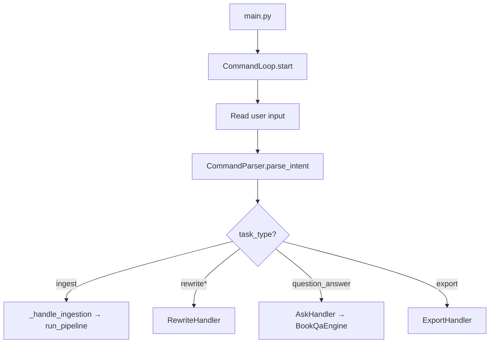

# Module: CLI Interaction

> **Code package:** `backend/src/modules/interaction/`  
> **Symbol reference:** [../code-reference/interaction.md](../code-reference/interaction.md)  
> **Legacy:** `doc/spec/01-entry-cli-interaction.md` (removed)  
> **Also used by:** `backend/services/chat_service.py` (web chat)

---

## 1. Purpose

Interactive terminal loop and intent routing for PDF ingestion, rewrite, Q&A, and export. The same `CommandParser` and handlers power both CLI and web chat.

---

## 2. Public APIs

```python
# backend/src/modules/interaction/command_loop.py
class CommandLoop:
    def start(self) -> None: ...  # Main REPL

# backend/src/modules/interaction/command_parser.py
class CommandParser:
    @staticmethod
    def parse_intent(user_input: str) -> IntentResult: ...
```

### IntentResult Fields

| Field | Values |
|-------|--------|
| `task_type` | `rewrite_book`, `study_notes`, `revision_notes`, `summarize_book`, `question_answer` |
| `scope` | `full_book`, `single_question` |
| `depth` | `very_short`, `short`, `medium`, `long` |
| `format_type` | `paragraph`, `bullet`, `exam_oriented` |

---

## 3. Handlers

| Handler | Status | Module | Used By |
|---------|--------|--------|---------|
| Ingestion | Active | inline in `CommandLoop._handle_ingestion` | CLI |
| Rewrite | Active | `handlers/rewrite_handler.py` | CLI + Web |
| Ask (Q&A) | Active | `handlers/ask_handler.py` | CLI + Web |
| Export | Active | `handlers/export_handler.py` | CLI |
| Question paper | Removed | — | Deleted 2026-06-01 |

```python
# backend/src/modules/interaction/handlers/rewrite_handler.py
class RewriteHandler:
    def __init__(self, store, book_id, book_title, pdf_path, ultimate_log_dir): ...
    # Delegates to RewriteEngine

# backend/src/modules/interaction/handlers/ask_handler.py
class AskHandler:
    def handle(self, intent: IntentResult, book_id, log_dir) -> str: ...
    # Delegates to BookQaEngine
```

---

## 4. Flow



**Web equivalent:** `ChatService.send_message()` uses same `CommandParser` + handlers. See [backend-api.md](../backend-api.md) §6.2.

---

## 5. Dependencies

- `src.book_pipeline.run_pipeline` for ingestion
- `src.shared.config` for paths and LLM settings
- `src.modules.generation.rewrite.RewriteEngine`
- `src.modules.generation.qa_engine.BookQaEngine`

---

## 6. Tests

| Test File | Coverage |
|-----------|----------|
| `tests/unit/test_llm_and_parser.py` | Intent detection patterns |
| `tests/unit/test_export_policy.py` | Export decisions per intent |

See [testing.md](../testing.md).
