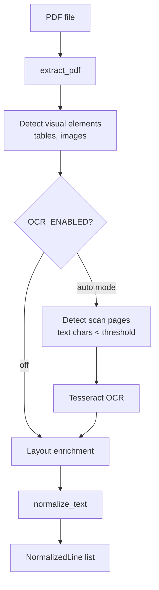

# Module: Ingestion

> **Code package:** `backend/src/modules/ingestion/`  
> **Legacy:** `doc/spec/03-ingestion-layer.md` (removed)  
> **Web entry:** `backend/services/ingestion_service.py`

---

## 1. Purpose

Convert PDF files into layout-enriched, normalized line streams including tables, OCR text, and visual elements.

---

## 2. Public APIs

| Function | Module | Output |
|----------|--------|--------|
| `extract_pdf(pdf_path)` | `pdf_extractor.py` | `(lines, book_title, visual_elements)` |
| `apply_ocr_to_pages(...)` | `ocr_stage.py` | synthetic page dicts + OCR log |
| `normalize_text(result)` | `text_normalizer.py` | `list[NormalizedLine]` |
| `lines_to_log(lines)` | `layout_enrichment.py` | layout JSON payload |

---

## 3. Extraction Flow



---

## 4. Page OCR Stage

When `OCR_ENABLED=true`, `extract_pdf` runs `apply_ocr_to_pages` after visual-element detection.

| Mode | Behavior |
|------|----------|
| `auto` | OCR only pages with < `OCR_MIN_TEXT_CHARS` extractable text |
| `force` | OCR all pages |
| `off` | Skip OCR |

**Two-up split** (`OCR_SPLIT_TWO_UP=true`): crop left/right halves; virtual page numbers `(pdf_page-1)*2+1` and `+2`.

Requires **Tesseract** installed. Set `TESSERACT_CMD` on Windows if not on PATH.

Requirements: [requirements-ocr-stage.md](../requirements-ocr-stage.md) · Config: [parameters-config.md](./parameters-config.md) §7

---

## 5. Web Ingestion

```python
# backend/services/ingestion_service.py
class IngestionService:
    def ingest_upload(self, user_id: str, file_path: str, original_name: str) -> BookSummary:
        # 1. Copy to output/uploads/{user_id}/
        # 2. extract_pdf → normalize
        # 3. BookRepository.save_book()
        # 4. run_pipeline(enable_logs=True, persist_to_db=False)
        # 5. TocRepository.save_full_toc()
        # 6. UserBookRepository.link(user_id, book_id, file_path, log_dir)
        # 7. [optional] RagService.ensure_index()
```

---

## 6. Dependencies

- PyMuPDF (`fitz`) via `pdf_extractor`
- `src/utils/pdf_reader.py`, `src/utils/ocr_reader.py`
- `src/shared/models.NormalizedLine`

---

## 7. Tests

| Test | Coverage |
|------|----------|
| `test_ocr_stage.py` | Scan detection, two-up split, virtual pages |

See [testing.md](../testing.md) §5.5.
