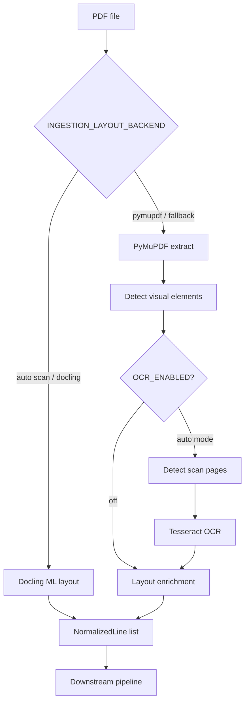

# Module: Ingestion

> **Code package:** `backend/src/modules/ingestion/`  
> **Symbol reference:** [../code-reference/ingestion.md](../code-reference/ingestion.md)  
> **Legacy:** `doc/spec/03-ingestion-layer.md` (removed)  
> **Web entry:** `backend/services/ingestion_service.py`

---

## 1. Purpose

Convert PDF files into layout-enriched, normalized line streams including tables, OCR text, and visual elements.

---

## 2. Public APIs

| Function | Module | Output |
|----------|--------|--------|
| `extract_pdf(pdf_path)` | `pdf_extractor.py` | `(lines, book_title, visual_elements)` |
| `apply_ocr_to_pages(...)` | `ocr_stage.py` | synthetic page dicts + OCR log |
| `normalize_text(result)` | `text_normalizer.py` | `list[NormalizedLine]` |
| `lines_to_log(lines)` | `layout_enrichment.py` | layout JSON payload |
| `compute_document_profile(lines, headings)` | `document_profile.py` | `DocumentCharacterProfile` |
| `load_document_profile(run_dir)` | `document_profile.py` | profile from `s00_document_profile.json` |

---

## 3b. Document character profile

After early title validation, `stage_compute_document_profile` measures universal shape signals (heading density, median body size, prose vs enumerated-line ratios) and derives knobs consumed by `build_ultimate_sections` and `RewriteEngine`.

Artifact: log key `document_profile` → `s00_document_profile.json`.

---

## 3. Extraction Flow



---

## 3b. ML layout backend (Docling)

When `INGESTION_LAYOUT_BACKEND=auto` or `docling`, and Docling is installed (`pip install -r requirements-ml-layout.txt`):

| Mode | Behavior |
|------|----------|
| `auto` | Docling when PDF is scan-like (low extractable text on sampled pages) or `INGESTION_LAYOUT_DOCLING_ALWAYS=true` |
| `docling` | Always Docling; fallback to PyMuPDF on error |
| `pymupdf` | Legacy path (font/bold/OCR signals) |

Docling labels `section_header` / `title` map to `is_bold`, `large_font` on `NormalizedLine` so existing candidate scoring (stage 03) works unchanged.

**quality_cloud profile:** `INGESTION_LAYOUT_DOCLING_ALWAYS=true` — prefer ML layout whenever Docling is available.

---

## 4. Page OCR Stage

When `OCR_ENABLED=true`, `extract_pdf` runs `apply_ocr_to_pages` after visual-element detection.

| Mode | Behavior |
|------|----------|
| `auto` | OCR only pages with < `OCR_MIN_TEXT_CHARS` extractable text |
| `force` | OCR all pages |
| `off` | Skip OCR |

**Two-up split** (`OCR_SPLIT_TWO_UP=true`): crop left/right halves; virtual page numbers `(pdf_page-1)*2+1` and `+2`.

Requires **Tesseract** installed. Set `TESSERACT_CMD` on Windows if not on PATH.

Requirements: [requirements-ocr-stage.md](../requirements-ocr-stage.md) · Config: [parameters-config.md](./parameters-config.md) §7

---

## 5. Web Ingestion

```python
# backend/services/ingestion_service.py
class IngestionService:
    def ingest_upload(self, user_id, upload_path, original_name, *, skip_rag=None) -> dict:
        # 1. Copy PDF → UPLOADS_FOLDER / {user_id} / {original_name}
        # 2. run_pipeline(enable_logs=True) — single extract_pdf inside stage_extract
        # 3. BookRepository.save_book() using PipelineResult.book_title / total_pages
        # 4. TocRepository.save_full_toc()
        # 5. UserBookRepository.link(user_id, book_id, file_path, log_dir)
        # 6. [optional] RagService.ensure_index() — default skip (UPLOAD_SKIP_RAG=true)
        #    uses PipelineResult.lines + stage_registry paths for 15d/15e/15f
```

**Paths:** `UPLOADS_FOLDER` = `{PROJECT_ROOT}/output/uploads`. Logs: `{LOGS_FOLDER}/run_<utc>/` (not `backend/logs/`).

**Performance note:** Do not call `extract_pdf()` before `run_pipeline()` — pipeline returns lines in `PipelineResult`.

---

## 6. Dependencies

- PyMuPDF (`fitz`) via `pdf_extractor`
- `src/utils/pdf_reader.py`, `src/utils/ocr_reader.py`
- `src/shared/models.NormalizedLine`

---

## 7. Tests

| Test | Coverage |
|------|----------|
| `test_ocr_stage.py` | Scan detection, two-up split, virtual pages |
| `test_document_profile.py` | Clause-dense vs prose profiles, subject-keyword guard |
| `test_ingestion_profile.py` | `fast_local` / `quality_cloud` overrides |

See [testing.md](../testing.md) §5.5.
