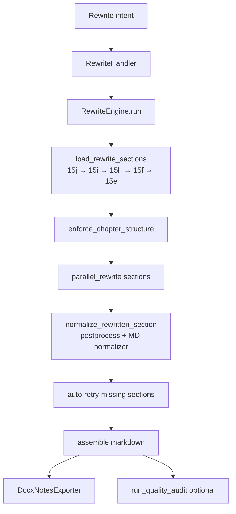
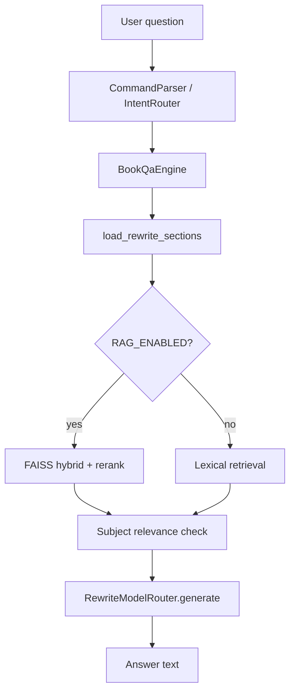

# Module: LLM & Generation

> **Code:** `backend/src/modules/generation/`, `backend/src/modules/pipeline/llm_chat_client.py`  
> **Symbol reference:** [../code-reference/generation.md](../code-reference/generation.md)  
> **Used by:** CLI, Web chat (`ChatService`)

---

## 1. Purpose

LLM overlays for doubted-section resolver (Stage 15b), full-book rewrite, and Q&A with RAG retrieval. Post-rewrite deterministic cleanup ensures export bodies pass line-audit gates.

---

## 2. Components

| Component | Status | Module |
|-----------|--------|--------|
| `LlmChatClient` | Active | `pipeline/llm_chat_client.py` |
| `RewriteModelRouter` | Active | `generation/model_router.py` |
| `RewriteEngine` | Active | `generation/rewrite.py` |
| `BookQaEngine` | Active | `generation/qa_engine.py` |
| `parallel_rewrite` | Active | `generation/parallel_rewrite.py` |
| `notes_body_postprocess` | Active | `generation/notes_body_postprocess.py` |
| `markdown_format_normalizer` | Active | `generation/markdown_format_normalizer.py` |
| `FastSegmentLlm` | Active | `structure/final_structuring/models/segment_llm_classifier.py` |
| Doubted resolver | Active | `structure/final_structuring/doubted_section_resolver.py` |
| Revalidation | Active | `structure/final_structuring/revalidation.py` |

---

## 3. Rewrite Flow



```python
# backend/src/modules/generation/rewrite.py
class RewriteEngine:
    def run(
        self,
        user_instruction: str,
        *,
        export_to_word: bool = False,
        pdf_path: str | None = None,
        ultimate_sections_path: Path | None = None,
        chapter_hierarchy_path: Path | None = None,
        lines: list | None = None,
    ) -> dict:  # { markdown, docx?, error? }
```

**Why `enforce_chapter_structure` before rewrite:** 15j can collapse a syllabus into one chapter; mirrors and statute-prose titles must be fixed before section jobs use headings.

**Provider order:** `REWRITE_PROVIDER_ORDER` env (e.g. `openai,gemini,llamacpp`)

**Inline auto-retry (P0):** After `parallel_rewrite`, when `chapter_hierarchy` is present and `REWRITE_AUTO_RETRY_ENABLED`, `retry_missing_sections` runs if coverage &lt; `REWRITE_AUTO_RETRY_MIN_COVERAGE` (overlap disabled on retry).

**Document profile:** Optional `document_profile` / `pipeline_log_dir` on `RewriteEngine.run` loads `s00_document_profile.json` for `rewrite_max_tokens`, `rewrite_overlap_chars`, and `enforce_single_topic_prompt`.

---

## 4. Prompt & body policy (book mode)

| Rule | Why |
|------|-----|
| Continuous prose paragraphs | User rejected pseudo-bullet paragraphs in book exports |
| Bullets only for enumerations/examples | Lists are fine; entire section as bullets is not |
| No meta filler ("This chapter covers…") | Line-audit FAIL |
| No heading echo in body | Export adds `##` title |
| Simple English = plain language, not short sentences | AC-06 + readability dimension removed — sentence length is not audited |

Source: `rewrite_prompts.py`, `document_format_style.py` — see [export-format.md](./export-format.md).

---

## 5. Post-rewrite cleanup

`notes_body_postprocess.postprocess_rewritten_section()` strips meta filler, heading echo, thin bullets, standalone bold — called from `normalize_rewritten_section()` after each LLM response.

---

## 6. Q&A Flow



---

## 7. Stage 15b (Doubted Section Resolver)

Runs when `first_toc_page > 3` (late TOC detected).

| Config | Default | Purpose |
|--------|---------|---------|
| `DOUBTED_RESOLVER_MODE` | `revalidate_selected` | `fast` \| `revalidate_selected` |
| `DOUBTED_RESOLVER_LLM` | `llamacpp` | `off` \| `ollama` \| `llamacpp` \| `bigbird` |

**Logs:** `15b_doubted_resolved.json`, `15b_revalidation.json`

---

## 8. LLM Providers

| Provider | Config Keys | Use Case |
|----------|-------------|----------|
| OpenAI | `OPENAI_API_KEY`, `OPENAI_MODEL` | Rewrite, Q&A, 15j |
| OpenRouter | `OPENROUTER_API_KEY`, `OPENROUTER_MODEL` | Batch pipeline default |
| Gemini | `GEMINI_API_KEY`, `GEMINI_MODEL` | Rewrite, Q&A |
| Ollama / llama.cpp | Local paths | `fast_local` profile |

See [parameters-config.md](./parameters-config.md).

---

## 9. Tests

| Test | Coverage |
|------|----------|
| `test_llm_and_parser.py` | Provider aliases, intent parsing |
| `test_parallel_rewrite.py` | Parallel section rewrite |
| `test_missing_section_rewrite.py` | Auto-retry missing sections |
| `test_qa_engine.py` | Lexical retrieval |
| `test_rewrite_validation.py` | Section coverage validation |
| `test_notes_body_postprocess.py` | Post-rewrite body cleanup |
| `test_rewrite_diagrams.py` | Mermaid diagram path |

See [testing.md](../testing.md).
