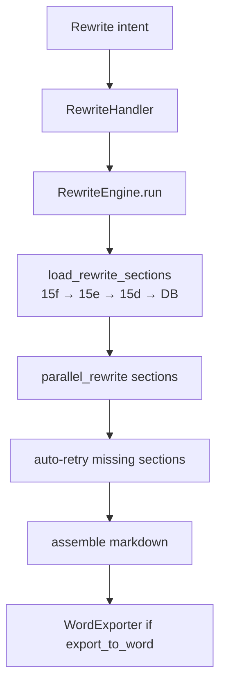
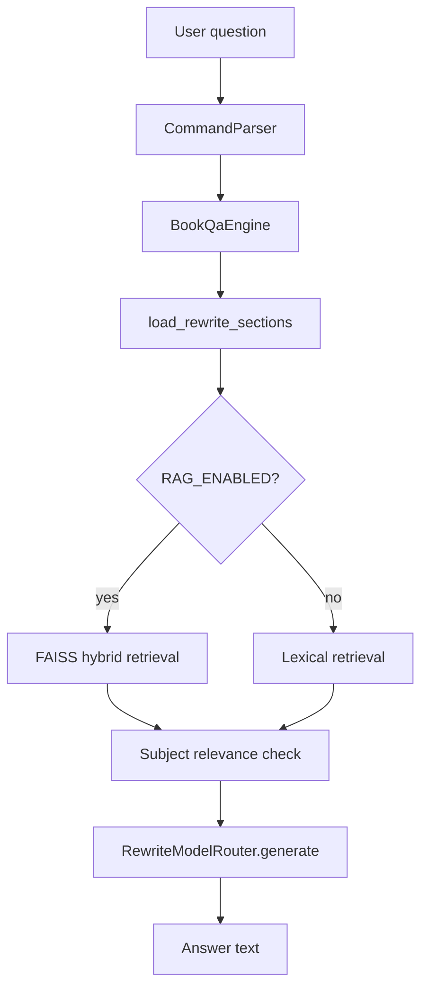

# Module: LLM & Generation

> **Code:** `backend/src/modules/generation/`, `backend/src/modules/pipeline/llm_chat_client.py`  
> **Used by:** CLI, Web chat (`ChatService`)

---

## 1. Purpose

LLM overlays for doubted-section resolver (Stage 15b), full-book rewrite, and Q&A with RAG retrieval.

---

## 2. Components

| Component | Status | Module |
|-----------|--------|--------|
| `LlmChatClient` | Active | `pipeline/llm_chat_client.py` |
| `RewriteModelRouter` | Active | `generation/model_router.py` |
| `RewriteEngine` | Active | `generation/rewrite.py` |
| `BookQaEngine` | Active | `generation/qa_engine.py` |
| `parallel_rewrite` | Active | `generation/parallel_rewrite.py` |
| `FastSegmentLlm` | Active | `structure/final_structuring/models/segment_llm_classifier.py` |
| Doubted resolver | Active | `structure/final_structuring/doubted_section_resolver.py` |
| Revalidation | Active | `structure/final_structuring/revalidation.py` |

---

## 3. Rewrite Flow



```python
# backend/src/modules/generation/rewrite.py
class RewriteEngine:
    def run(
        self,
        user_instruction: str,
        *,
        export_to_word: bool = False,
        pdf_path: str | None = None,
        ultimate_sections_path: Path | None = None,
        chapter_hierarchy_path: Path | None = None,
        lines: list | None = None,
    ) -> dict:  # { markdown, docx?, error? }
```

**Provider order:** `REWRITE_PROVIDER_ORDER` env (e.g. `openai,gemini,llamacpp`)

---

## 4. Q&A Flow



```python
# backend/src/modules/generation/qa_engine.py
class BookQaEngine:
    def answer(self, question: str, *, book_id: str, sections: list) -> str: ...
```

---

## 5. Stage 15b (Doubted Section Resolver)

Runs when `first_toc_page > 3` (late TOC detected).

| Config | Default | Purpose |
|--------|---------|---------|
| `DOUBTED_RESOLVER_MODE` | `revalidate_selected` | `fast` \| `revalidate_selected` |
| `DOUBTED_RESOLVER_LLM` | `llamacpp` | `off` \| `ollama` \| `llamacpp` \| `bigbird` |

**Logs:** `15b_doubted_resolved.json`, `15b_revalidation.json`

---

## 6. LLM Providers

| Provider | Config Keys | Use Case |
|----------|-------------|----------|
| OpenAI | `OPENAI_API_KEY`, `OPENAI_MODEL` | Rewrite, Q&A, 15e/15f |
| Gemini | `GEMINI_API_KEY`, `GEMINI_MODEL` | Rewrite, Q&A |
| Ollama | `OLLAMA_BASE_URL`, `OLLAMA_MODEL` | Local inference |
| llama.cpp | `LLAMACPP_MODEL_PATH`, `REWRITE_LLAMACPP_MODEL_PATH` | Local GGUF |

See [parameters-config.md](./parameters-config.md).

---

## 7. Tests

| Test | Coverage |
|------|----------|
| `test_llm_and_parser.py` | Provider aliases, intent parsing |
| `test_parallel_rewrite.py` | Parallel section rewrite |
| `test_missing_section_rewrite.py` | Auto-retry missing sections |
| `test_qa_engine.py` | Lexical retrieval |
| `test_rag_retriever.py` | Hybrid semantic retrieval |
| `test_rewrite_validation.py` | Section coverage validation |

See [testing.md](../testing.md).
