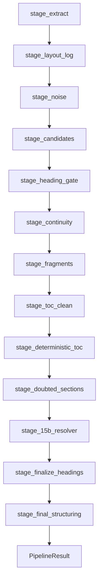

# Module: Pipeline Core

> **Code:** `backend/src/modules/pipeline/runner.py`, `stages.py`, `context.py`  
> **Legacy:** `doc/spec/02-pipeline-core-chain.md` (removed)

---

## 1. Purpose

Single production orchestrator for deterministic book structure extraction, optional stage logging, and optional SQLite persistence. Plugin architecture: runner shell executes `STAGES` list; each stage mutates `PipelineContext`.

---

## 2. Public API

```python
# backend/src/modules/pipeline/runner.py
def run_pipeline(
    pdf_path: str,
    *,
    enable_logs: bool = False,
    persist_to_db: bool = False,
) -> tuple[PipelineResult, PipelineLogger | None]:
    ...
```

**Re-export:** `from src.book_pipeline import run_pipeline`

---

## 3. Stage Chain



| # | Stage Function | Log Artifact |
|---|----------------|--------------|
| 1 | `stage_extract` | — |
| 2 | `stage_layout_log` | `01_layout_lines.json`, `13_visual_elements.json` |
| 3 | `stage_noise` | `02_noise_filter.json` |
| 4 | `stage_candidates` | `03_candidate_scoring.json` |
| 5 | `stage_heading_gate` | `03b_heading_validity_gate.json` |
| 6 | `stage_continuity` | `08b_continuity_filter.json` |
| 7 | `stage_fragments` | `07_fragments.json` |
| 8 | `stage_toc_clean` | — |
| 9 | `stage_deterministic_toc` | `10_deterministic_toc.json`, `11_book_metadata.json` |
| 10 | `stage_doubted_sections` | `14_doubted_sections.json` |
| 11 | `stage_15b_resolver` | `15b_doubted_resolved.json`, `15b_revalidation.json` |
| 12 | `stage_finalize_headings` | `09_final_headings.json`, `12_final_headings_2.json` |
| 13 | `stage_final_structuring` | `15a`–`15f`, `15c_final_book.json`, `16_rag_snapshot.json` |

Full log file list: [logging-debug.md](./logging-debug.md) §3

---

## 4. PipelineContext

```python
# backend/src/modules/pipeline/context.py
@dataclass
class PipelineContext:
    pdf_path: str
    enable_logs: bool
    persist_to_db: bool
    logger: PipelineLogger
    lines: list = field(default_factory=list)
    book_title: str = ""
    visual_elements: dict = field(default_factory=dict)
    # ... stage outputs accumulated here
```

---

## 5. Runner Implementation

```python
# backend/src/modules/pipeline/runner.py
def run_pipeline(pdf_path, *, enable_logs=False, persist_to_db=False):
    logger = PipelineLogger.create(pdf_file=Path(pdf_path).name, enabled=enable_logs)
    ctx = PipelineContext(pdf_path=pdf_path, enable_logs=enable_logs,
                          persist_to_db=persist_to_db, logger=logger)
    for stage in STAGES:
        stage(ctx)
    result = PipelineResult(
        final_headings=ctx.toc_out,
        fragments=ctx.fragments_result.fragments,
        heading_to_fragment_id=ctx.fragments_result.heading_to_fragment_id,
    )
    if persist_to_db:
        _persist(ctx, result)
    return result, (logger if enable_logs else None)
```

**No business logic in runner** — only stage iteration and optional persistence hook (ADR-008).

---

## 6. Callers

| Caller | `enable_logs` | `persist_to_db` |
|--------|---------------|-----------------|
| CLI `CommandLoop` | `False` | `False` |
| Web `IngestionService` | `True` | `False` (TOC saved separately) |
| Debug `run_toc_trace` | `True` | `True` |
| Integration tests | `True` | `True` |

---

## 7. Dependencies

- All `src/modules/ingestion/*` and `src/modules/structure/*` stage modules
- `src/modules/structure/logging/pipeline_logger.py`
- `src/modules/storage/*` when `persist_to_db=True`

---

## 8. Tests

| Test | Coverage |
|------|----------|
| `test_pipeline_stages.py` | Doubted sections, metadata stripping |
| `test_logging_contract.py` | All stage JSON files written |
| `test_fragment_coverage.py` | Fragment mappings complete |

See [testing.md](../testing.md) §6.
