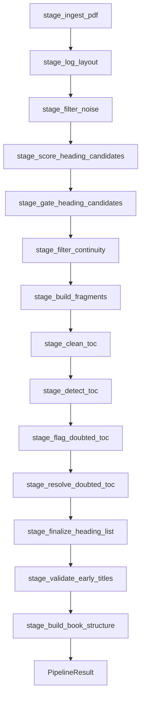

# Module: Pipeline Core

> **Code:** `backend/src/modules/pipeline/runner.py`, `stages.py`, `context.py`, `stage_registry.py`, `stage_catalog.py`  
> **Symbol reference:** [../code-reference/pipeline.md](../code-reference/pipeline.md)  
> **Stage names (human-readable):** [stage-catalog.md](./stage-catalog.md)  
> **Legacy:** `doc/spec/02-pipeline-core-chain.md` (removed)

---

## 1. Purpose

Single production orchestrator for deterministic book structure extraction, optional stage logging, and optional SQLite persistence. Plugin architecture: runner shell executes `STAGES` list; each stage mutates `PipelineContext`.

---

## 2. Public API

```python
# backend/src/modules/pipeline/runner.py
def run_pipeline(
    pdf_path: str,
    *,
    enable_logs: bool = False,
    persist_to_db: bool = False,
) -> tuple[PipelineResult, PipelineLogger | None]:
    ...
```

**Re-export:** `from src.book_pipeline import run_pipeline`

**`PipelineResult` fields:**

| Field | Type | Description |
|-------|------|-------------|
| `final_headings` | `list[FinalHeading]` | TOC-stripped headings |
| `fragments` | `list[Fragment]` | Text blocks |
| `heading_to_fragment_id` | `dict` | Heading → fragment map |
| `lines` | `list[NormalizedLine]` | Extracted PDF lines (for RAG / rewrite) |
| `book_title` | `str` | From PDF metadata or filename |
| `total_pages` | `int` | Max page number from lines |

---

## 3. Stage Chain



| # | Stage function | Semantic ID | Log key → artifact |
|---|----------------|-------------|-------------------|
| 1 | `stage_ingest_pdf` | `ingest_pdf` | — (mutates `ctx.lines` only) |
| 2 | `stage_log_layout` | `log_layout` | `layout_lines` → `s01_layout_lines.json`, `visual_elements` → `s11_visual_elements.json` |
| 3 | `stage_filter_noise` | `filter_noise` | `noise_filter` → `s02_noise_filter.json` |
| 4 | `stage_score_heading_candidates` | `score_candidates` | `candidate_scoring` → `s03_candidate_scoring.json` |
| 5 | `stage_gate_heading_candidates` | `gate_headings` | `heading_validity_gate` → `s04_heading_validity_gate.json` |
| 6 | `stage_filter_continuity` | `filter_continuity` | `continuity_filter` → `s06_continuity_filter.json` |
| 7 | `stage_build_fragments` | `build_fragments` | `fragments` → `s05_fragments.json` |
| 8 | `stage_clean_toc` | `clean_toc` | — |
| 9 | `stage_detect_toc` | `detect_toc` | (logged in finalize) |
| 10 | `stage_flag_doubted_toc` | `flag_doubted_toc` | `doubted_sections` → `s12_doubted_sections.json` |
| 11 | `stage_resolve_doubted_toc` | `resolve_doubted_toc` | `resolve_doubted_toc` → `s15b_doubted_resolved.json`, `resolve_doubted_revalidation` → `s15b_revalidation.json` |
| 12 | `stage_finalize_heading_list` | `finalize_headings` | `final_headings` → `s07_…`, `deterministic_toc` → `s08_…`, `book_metadata` → `s09_…`, `final_headings_2` → `s10_…` |
| 13 | `stage_validate_early_titles` | `validate_early_titles` | `heading_title_validation` → `s13_…` |
| 14 | `stage_build_book_structure` | `build_book_structure` | structure phases → see below |

Deprecated aliases (`stage_extract`, `stage_final_structuring`, …) remain in `stages.py`.  
Legacy log keys (`15e_chapter_hierarchy`, …) still resolve via `normalize_log_key()`.

### `stage_build_book_structure` artifacts (execution order)

Orchestrator: `structure_orchestrator.py` (four logical phases).  
**Authoritative name map:** [stage-catalog.md](./stage-catalog.md) §3 and §7.

| Order | Log key (semantic) | Artifact file | Phase |
|-------|-------------------|---------------|-------|
| 1 | `partition_tree` | `s15a_heading_hierarchy.json` | partition |
| 2 | `partition_sections` | `s15d_ultimate_sections.json` | partition |
| 3 | `group_chapters` | `s15e_chapter_hierarchy.json` | chapters |
| 4 | `place_chapters` | `s15h_chapter_placement.json` | chapters |
| 5 | `clean_titles` | `s15f_heading_cleanup.json` | titles |
| 6 | `refine_titles` | `s15i_heading_refinement.json` | titles |
| 7 | `cloud_hierarchy` | `s15j_hierarchy_openai.json` | titles (gated) |
| 8 | `validate_titles` | `s15g_title_validation.json` | publish |
| 9 | `assemble_book` | `s15c_final_book.json` | publish |
| 10 | `rag_snapshot` | `s16_rag_snapshot.json` | publish |

`enforce_chapter_structure()` runs inside `place_chapters`, `refine_titles`, `cloud_hierarchy`, and `validate_titles` — see [structure-extraction.md](./structure-extraction.md).

**Hierarchy read preference:** `resolve_chapter_hierarchy_artifact()` → `cloud_hierarchy` → `refine_titles` → `place_chapters` → `clean_titles` → `validate_titles` → `group_chapters`.

**Authoritative mapping:** `backend/src/modules/pipeline/stage_registry.py`  
**Full table:** [logging-debug.md](./logging-debug.md) §3  
**Legacy filenames** (`01_`, `03b_`, `15d_` without `s` prefix): read-compatible via `resolve_existing_artifact()`.

---

## 4. Stage Registry Helpers

```python
from src.modules.pipeline.stage_registry import (
    STAGE_PARTITION_SECTIONS,
    STAGE_GROUP_CHAPTERS,
    STAGE_CLEAN_TITLES,
    resolve_existing_artifact,
    require_artifact,
    artifact_path,
    stage_log_filename,
)
from src.modules.pipeline.stage_catalog import normalize_log_key  # legacy 15e_* → semantic

path = resolve_existing_artifact(log_dir, STAGE_PARTITION_SECTIONS)
out = artifact_path(log_dir, STAGE_CLEAN_TITLES, for_write=True)
```

Deprecated: `STAGE_15D`, `STAGE_15E`, … (aliases to the constants above).

**Do not hardcode** artifact filenames in services/scripts — use registry helpers.

---

## 5. PipelineContext

```python
# backend/src/modules/pipeline/context.py
@dataclass
class PipelineContext:
    pdf_path: str
    enable_logs: bool
    persist_to_db: bool
    logger: PipelineLogger
    lines: list = field(default_factory=list)
    book_title: str = ""
    visual_elements: list = field(default_factory=list)
    # ... stage outputs accumulated here
```

---

## 6. Logging Location

`PipelineLogger.create()` writes to `{LOGS_FOLDER}/run_<utc>/` where `LOGS_FOLDER = {PROJECT_ROOT}/logs` by default.

Config: [parameters-config.md](./parameters-config.md) §2 · Detail: [logging-debug.md](./logging-debug.md)

---

## 7. Runner Implementation

```python
def run_pipeline(pdf_path, *, enable_logs=False, persist_to_db=False):
    logger = PipelineLogger.create(pdf_file=Path(pdf_path).name, enabled=enable_logs)
    ctx = PipelineContext(...)
    for stage in STAGES:
        stage(ctx)
    result = PipelineResult(
        final_headings=ctx.toc_out,
        fragments=...,
        heading_to_fragment_id=...,
        lines=list(ctx.lines),
        book_title=ctx.book_title or Path(ctx.pdf_path).stem,
        total_pages=_total_pages(ctx.lines),
    )
    ...
```

**No business logic in runner** — only stage iteration and optional persistence (ADR-008). Artifact persist loop uses `STAGE_LOG_FILES` from registry.

---

## 8. Callers

| Caller | `enable_logs` | `persist_to_db` | Notes |
|--------|---------------|-----------------|-------|
| CLI `CommandLoop` | `True` | `False` | Single `extract_pdf` via pipeline |
| Web `IngestionService` | `True` | `False` | TOC saved via `TocRepository` |
| Debug `run_toc_trace` | `True` | `True` | |
| Integration tests | `True` | varies | Uses `LOGS_FOLDER` |

---

## 9. Dependencies

- All `src/modules/ingestion/*` and `src/modules/structure/*` stage modules
- `src/modules/structure/logging/pipeline_logger.py`
- `src/modules/pipeline/stage_registry.py`
- `src/modules/storage/*` when `persist_to_db=True`

---

## 10. Tests

| Test | Coverage |
|------|----------|
| `test_pipeline_stages.py` | Doubted sections, metadata stripping |
| `test_logging_contract.py` | Core stage JSON files under `LOGS_FOLDER` |
| `test_stage_registry.py` | Filename map, legacy fallback |
| `test_pipeline_single_extract.py` | One `extract_pdf` per upload |
| `test_fragment_coverage.py` | Fragment mappings complete |

See [testing.md](../testing.md) §6.
