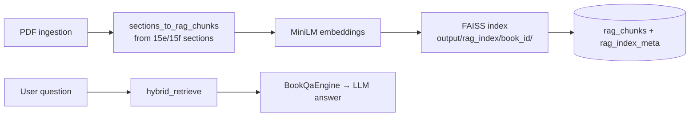

# Module: Vector RAG

> **Code:** `backend/src/modules/rag/`, `backend/src/modules/storage/rag_repository.py`  
> **Config:** `backend/config/default.yaml`, `backend/src/shared/config.py`

---

## 1. Purpose

Semantic retrieval for Q&A using **MiniLM embeddings + FAISS**, fused with lexical scores.

---

## 2. Flow

1. After ingestion, `RagService.ensure_index()` builds chunks from 15e/15f sections
2. Chunks embedded with `all-MiniLM-L6-v2`, stored in FAISS
3. Metadata persisted in SQLite `rag_chunks` + `rag_index_meta`
4. `BookQaEngine` calls hybrid retrieval before LLM answer generation

**Note:** Web upload skips RAG by default (`UPLOAD_SKIP_RAG=true`). Index built on demand at Q&A time.

---

## 3. Files

| File | Role |
|------|------|
| `rag/service.py` | `RagService` — build/load index, retrieve |
| `rag/chunk_builder.py` | `sections_to_rag_chunks` — section → chunk records |
| `rag/indexer.py` | FAISS index build and save |
| `rag/retriever.py` | `hybrid_retrieve` — vector + lexical fusion |
| `storage/rag_repository.py` | `RagRepository` — SQLite chunk/meta persistence |

---

## 4. Public API

| Function / Class | Module | Description |
|------------------|--------|-------------|
| `RagService.ensure_index` | `rag/service.py` | Build or load FAISS index for book |
| `RagService.retrieve` | `rag/service.py` | Hybrid top-k retrieval |
| `sections_to_rag_chunks` | `rag/chunk_builder.py` | Section → chunk records |
| `hybrid_retrieve` | `rag/retriever.py` | Vector + lexical score fusion |
| `RagRepository` | `storage/rag_repository.py` | Persist chunks and index metadata |

---

## 5. Config

**Authoritative:** [parameters-config.md](./parameters-config.md) §6 (`RAG_*`, `UPLOAD_SKIP_RAG`)

---

## 6. Dependencies

- `faiss-cpu`
- `sentence-transformers` (all-MiniLM-L6-v2)

---

## 7. Tests

| Test | Coverage |
|------|----------|
| `test_rag_retriever.py` | One-chunk-per-section, hybrid semantic preference |
| `test_qa_engine.py` | Lexical fallback when RAG disabled |

See [testing.md](../testing.md) §5.6, §5.7.
