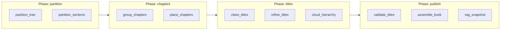

# Module: Pipeline Stage Catalog

> **Code:** `backend/src/modules/pipeline/stage_catalog.py`  
> **Registry (log keys):** [pipeline-core.md](./pipeline-core.md)  
> **Structure orchestrator:** [structure-extraction.md](./structure-extraction.md)

---

## 1. Purpose

Single human-readable map of every pipeline step: **what it does**, **why it exists**, and how it relates to **legacy log keys** (`s01_…`, `s15a_…`) and **deprecated function names** (`stage_extract`, etc.).

**No functionality was removed** when consolidating structure — sub-steps still run and still write the same JSON artifacts. Consolidation is **orchestration grouping** (`structure_orchestrator.py`) and **readable naming** (`stages.py`).

**Config-driven skips** (e.g. `cloud_hierarchy` when local output is healthy) are profile gates — code paths remain; use `INGESTION_PROFILE=quality_cloud` for the full cloud path.

---

## 2. Top-level pipeline (14 steps)

Executed by `runner.py` via `STAGES` in this order.

| # | Semantic ID | Display name | `stages.py` function | Log key → artifact | Phase |
|---|-------------|--------------|----------------------|-------------------|-------|
| 1 | `ingest_pdf` | Ingest PDF | `stage_ingest_pdf` | — | ingest |
| 2 | `log_layout` | Log layout | `stage_log_layout` | `layout_lines` → `s01_…`, `visual_elements` → `s11_…` | ingest |
| 3 | `filter_noise` | Filter noise | `stage_filter_noise` | `noise_filter` → `s02_…` | heading_detect |
| 4 | `score_candidates` | Score heading candidates | `stage_score_heading_candidates` | `candidate_scoring` → `s03_…` | heading_detect |
| 5 | `gate_headings` | Validate heading candidates | `stage_gate_heading_candidates` | `heading_validity_gate` → `s04_…` | heading_detect |
| 6 | `filter_continuity` | Continuity filter | `stage_filter_continuity` | `continuity_filter` → `s06_…` | heading_detect |
| 7 | `build_fragments` | Build fragments | `stage_build_fragments` | `fragments` → `s05_…` | heading_detect |
| 8 | `clean_toc` | Clean TOC headings | `stage_clean_toc` | — | toc |
| 9 | `detect_toc` | Detect TOC structure | `stage_detect_toc` | `deterministic_toc` → `s08_…` (also in finalize) | toc |
| 10 | `flag_doubted_toc` | Flag doubtful TOC | `stage_flag_doubted_toc` | `doubted_sections` → `s12_…` | toc |
| 11 | `resolve_doubted_toc` | Resolve doubtful TOC | `stage_resolve_doubted_toc` | `resolve_doubted_toc` → `s15b_…` | toc |
| 12 | `finalize_headings` | Finalize heading list | `stage_finalize_heading_list` | `final_headings` → `s07_…`, metadata `s09_…`, `s10_…` | heading_detect |
| 13 | `validate_early_titles` | Early title validation | `stage_validate_early_titles` | `heading_title_validation` → `s13_…` | heading_detect |
| 14 | `compute_document_profile` | Compute document profile | `stage_compute_document_profile` | `document_profile` → `s00_document_profile.json` | ingest |
| 15 | `build_book_structure` | Build book structure | `stage_build_book_structure` | structure phases (see §3) | structure |

**Deprecated aliases** (still importable): `stage_extract`, `stage_noise`, `stage_final_structuring`, etc. — see `LEGACY_FN_ALIASES` in `stage_catalog.py`.

---

## 3. Structure sub-steps (10 artifacts → 4 logical phases)

`stage_build_book_structure` delegates to `run_structure_phases()` in `structure_orchestrator.py`.

| Semantic ID | Display name | Log key | Artifact file | Logical group | Purpose |
|-------------|--------------|---------|---------------|---------------|---------|
| `partition_tree` | Partition heading tree | `partition_tree` | `s15a_heading_hierarchy.json` | partition | Nest validated headings into parent/child tree |
| `partition_sections` | Partition rewrite sections | `partition_sections` | `s15d_ultimate_sections.json` | partition | Size sections for parallel LLM rewrite |
| `group_chapters` | Group chapters | `group_chapters` | `s15e_chapter_hierarchy.json` | chapters | Assign sections to chapters (rules/MiniLM; cloud if profile allows) |
| `place_chapters` | Place & split chapters | `place_chapters` | `s15h_chapter_placement.json` | chapters | Split mega-chapters, rebalance page order |
| `clean_titles` | Clean titles | `clean_titles` | `s15f_heading_cleanup.json` | titles | Disambiguate weak headings; drop generic labels |
| `refine_titles` | Refine titles | `refine_titles` | `s15i_heading_refinement.json` | titles | Fix verbose/mirrored titles before rewrite |
| `cloud_hierarchy` | Cloud hierarchy polish | `cloud_hierarchy` | `s15j_hierarchy_openai.json` | titles | Optional cloud regroup + naming (gated by profile) |
| `validate_titles` | Validate titles | `validate_titles` | `s15g_title_validation.json` | publish | Late rules safety net on titles |
| `assemble_book` | Assemble final book | `assemble_book` | `s15c_final_book.json` | publish | Merge hierarchy + sections for export |
| `rag_snapshot` | RAG snapshot | `rag_snapshot` | `s16_rag_snapshot.json` | publish | Section bodies for vector index (no embeddings here) |

**Note:** `resolve_doubted_toc` runs in the **top-level** TOC phase before structure. Orchestrator order: **partition → chapters → titles → publish**. All artifacts are still emitted.

---

## 4. Are we redoing work across stages?

| Concern | Answer |
|---------|--------|
| Double PDF extract | **Fixed** — only `stage_ingest_pdf` calls `extract_pdf`; rewrite scripts reuse `ctx.lines`. |
| Heading detection vs structure | **Different jobs** — detection finds candidates; structure builds chapter tree and rewrite sections. No duplicate LLM for the same title fix unless a later phase intentionally refines (`clean_titles` → `refine_titles` → optional `cloud_hierarchy`). |
| `cloud_hierarchy` vs local titles | **Optional cloud polish** when local grouping/titles are insufficient; gated by `hierarchy_needs_cloud_refinement()` and `INGESTION_PROFILE`. |
| `validate_titles` vs s13 early validation | **Defense in depth** — s13 catches citation fragments early; `validate_titles` is a late rules pass after hierarchy edits. |
| TOC clean vs detect vs doubted | Sequential TOC pipeline — clean candidates, detect spans, flag/resolve late-TOC books (15b). |

---

## 5. Progress UI mapping

`PIPELINE_STAGE_PROGRESS` in `stage_registry.py` uses semantic function names. `stage_progress_for()` accepts legacy aliases.

---

## 7. Legacy numeric IDs → semantic log keys

Old keys still work via `normalize_log_key()` / `LEGACY_LOG_KEY_ALIASES`.

| Old log key | New log key | Display name | On-disk file (unchanged) |
|-------------|-------------|--------------|--------------------------|
| `15b_doubted_resolved` | `resolve_doubted_toc` | Resolve doubtful TOC | `s15b_doubted_resolved.json` |
| `15b_revalidation` | `resolve_doubted_revalidation` | Resolve doubtful (audit) | `s15b_revalidation.json` |
| `15a_heading_hierarchy` | `partition_tree` | Partition heading tree | `s15a_heading_hierarchy.json` |
| `15d_ultimate_sections` | `partition_sections` | Partition rewrite sections | `s15d_ultimate_sections.json` |
| `15e_chapter_hierarchy` | `group_chapters` | Group chapters | `s15e_chapter_hierarchy.json` |
| `15h_chapter_placement` | `place_chapters` | Place & split chapters | `s15h_chapter_placement.json` |
| `15f_heading_cleanup` | `clean_titles` | Clean titles | `s15f_heading_cleanup.json` |
| `15i_heading_refinement` | `refine_titles` | Refine titles | `s15i_heading_refinement.json` |
| `15j_hierarchy_openai` | `cloud_hierarchy` | Cloud hierarchy polish | `s15j_hierarchy_openai.json` |
| `15g_title_validation` | `validate_titles` | Validate titles | `s15g_title_validation.json` |
| `15c_final_book` | `assemble_book` | Assemble final book | `s15c_final_book.json` |
| `16_rag_snapshot` | `rag_snapshot` | RAG snapshot | `s16_rag_snapshot.json` |

**Code constants:** `STAGE_GROUP_CHAPTERS`, `STAGE_PARTITION_SECTIONS`, … (preferred). Deprecated: `STAGE_15E`, `STAGE_15D`, …

---

## 6. Code reference

| Symbol | File | Purpose |
|--------|------|---------|
| `StageSpec` | `stage_catalog.py` | One step: semantic ID, display name, log contract |
| `PIPELINE_STAGES` | `stage_catalog.py` | 14 top-level steps |
| `STRUCTURE_PHASES` | `stage_catalog.py` | 10 structure sub-steps |
| `STRUCTURE_LOGICAL_GROUPS` | `stage_catalog.py` | partition / chapters / titles / publish |
| `LOG_KEY_TO_SEMANTIC` | `stage_catalog.py` | Legacy log key → semantic ID |
| `LEGACY_FN_ALIASES` | `stage_catalog.py` | Old `stage_*` name → new name |
| `semantic_stage_id()` | `stage_registry.py` | Resolve log key to semantic ID |

Full symbol tables: [../code-reference/pipeline.md](../code-reference/pipeline.md).
