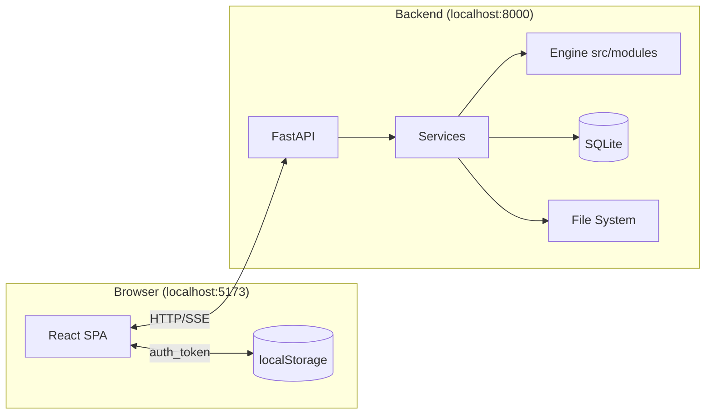
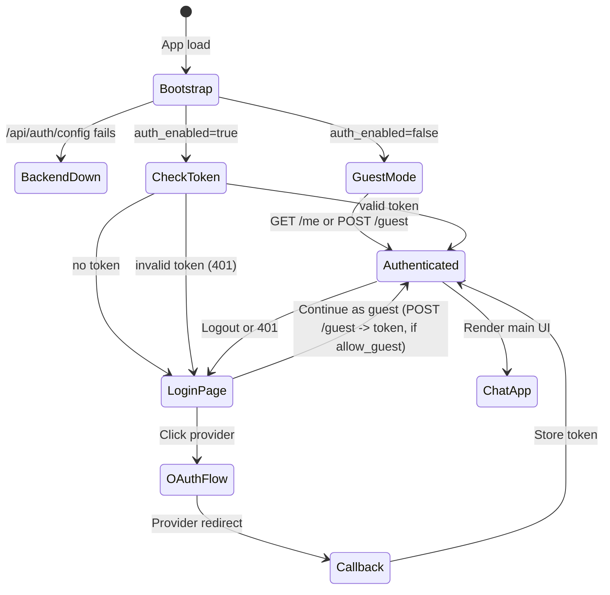
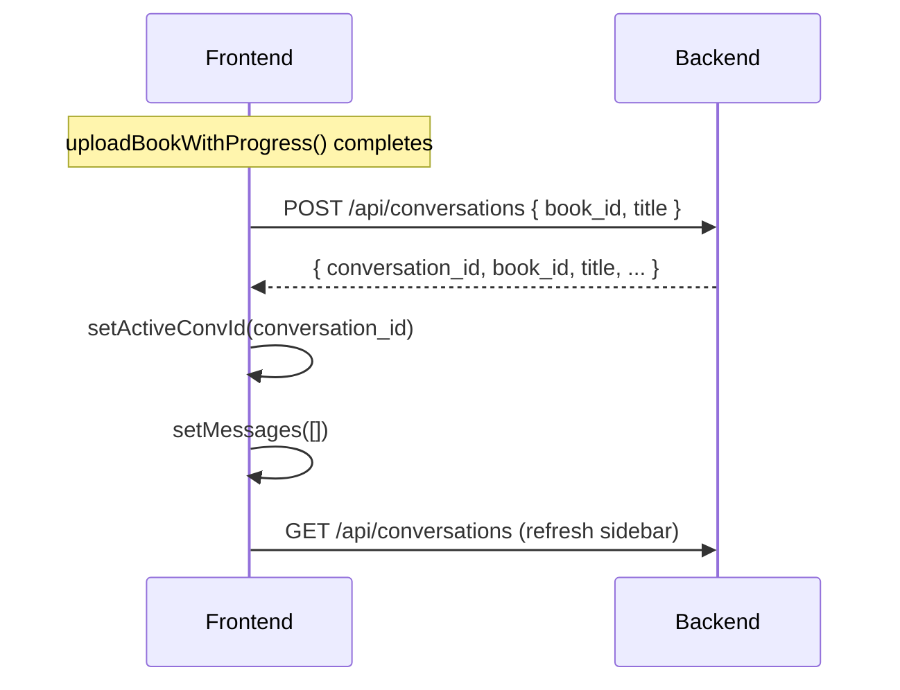
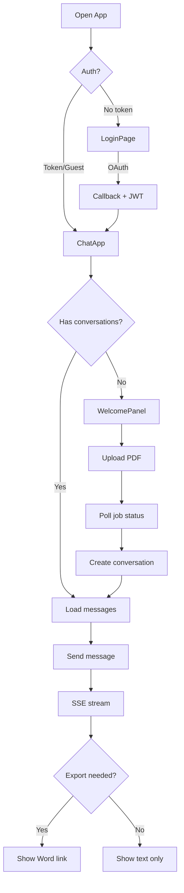
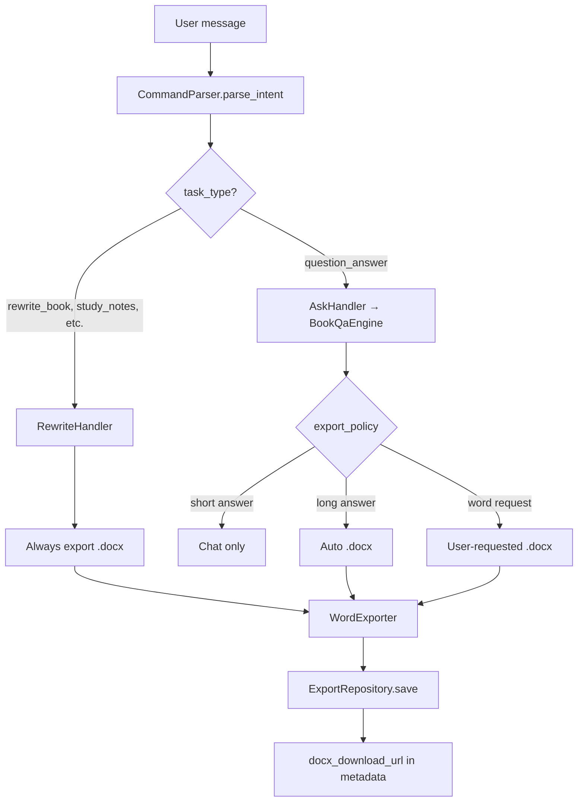

# UI ↔ Backend Integration Guide

> **Role:** Authoritative for cross-boundary contracts only (auth, upload, SSE, export URLs).  
> **Not here:** Endpoint details → [backend-api.md](./backend-api.md) · UI internals → [frontend.md](./frontend.md) · Requirement IDs → [requirements-web-platform.md](./requirements-web-platform.md)

---

## 1. System Overview



**Dev proxy:** Vite forwards `/api/*` to `http://localhost:8000`.  
**Production:** Set `VITE_API_BASE=http://backend-host:8000` in frontend env.

---

## 2. Authentication Contract

### Frontend Responsibilities

| Action | Implementation |
|--------|----------------|
| Store JWT | `localStorage.setItem("auth_token", token)` |
| Attach to requests | `Authorization: Bearer ${token}` header |
| Handle 401 | Clear token, redirect to `/` |
| OAuth callback | Parse `?token=` from URL, store, redirect to `/` |
| Guest mode | `POST /api/auth/guest`; store returned `token` if present (Bearer JWT) |
| Authed download | DOCX via `downloadFile` blob fetch with Bearer header (not `<a href>`) |

### Backend Responsibilities

| Action | Implementation |
|--------|----------------|
| Issue JWT | After OAuth callback **or** guest login (when `AUTH_ENABLED=true`) |
| Validate JWT | `get_current_user` dependency on protected routes (OAuth + guest tokens) |
| Return 401 | Invalid/expired token |
| Config endpoint | `GET /api/auth/config` → `{ auth_enabled, allow_guest }` |
| Guest endpoint | `POST /api/auth/guest` → `{ user, token }`; 403 only if `allow_guest=false` |

### Auth State Machine



---

## 3. Upload Contract

### Request

```
POST /api/books/upload
Content-Type: multipart/form-data
Authorization: Bearer <token>

file: <PDF binary>
```

### Response (Immediate)

```json
{
  "job_id": "uuid",
  "status": "processing",
  "message": "Upload received, processing started"
}
```

### Polling Contract

```
GET /api/books/upload/{job_id}
Authorization: Bearer <token>
```

**Poll interval:** 2 seconds  
**Max duration:** 20 minutes (600 polls)  
**Terminal states:** `done` | `error`

| Status | Frontend Action |
|--------|-----------------|
| `processing` | Continue polling, update status message |
| `done` | Extract `book`, create conversation, switch to chat |
| `error` | Show `error` field in error banner |

### Post-Upload Flow



---

## 4. Chat Contract

### Send Message (SSE)

```
POST /api/conversations/{id}/messages/stream
Content-Type: application/json
Authorization: Bearer <token>

{ "content": "user message text" }
```

### SSE Response Format

```
event: status
data: {"stage": "parsing_intent", "detail": "Analyzing request"}

event: status
data: {"stage": "answering_question", "detail": "Searching book"}

event: done
data: {"assistant_message": {...}, "docx_available": true, "docx_download_url": "/api/exports/abc123"}
```

### Frontend SSE Parser

```typescript
// auth/api.ts — simplified
const reader = res.body.getReader();
let buffer = "";
while (true) {
  const { done, value } = await reader.read();
  if (done) break;
  buffer += decoder.decode(value);
  // Parse "event:" and "data:" blocks
  if (event === "status") onStatus(JSON.parse(data));
  if (event === "done") return JSON.parse(data);
  if (event === "error") throw new Error(JSON.parse(data).detail);
}
```

### Assistant Message Shape

```json
{
  "message_id": "uuid",
  "role": "assistant",
  "content": "Markdown answer text...",
  "export_id": "uuid-or-null",
  "metadata": {
    "intent": "question_answer",
    "docx_available": true,
    "docx_download_url": "/api/exports/uuid"
  },
  "created_at": "2026-06-07T12:00:00Z"
}
```

### Frontend Rendering Rules

| Field | UI Behavior |
|-------|-------------|
| `role: "user"` | Plain text bubble, right-aligned |
| `role: "assistant"` | Markdown render via `react-markdown` |
| `metadata.docx_download_url` | Show "Download Word file" link |
| `content` (long) | Scrollable bubble, no truncation |

---

## 5. Export/Download Contract

### Trigger (Backend-Side Only)

Frontend does NOT call export endpoints directly. Export is triggered by chat intent:

| User Says | Backend Intent | Export? |
|-----------|----------------|---------|
| "Rewrite the full book" | `rewrite_book` | Always |
| "Explain negligence" (short) | `question_answer` | No |
| "Explain everything about torts" (long) | `question_answer` | Auto if > 4000 chars |
| "Give me word file" | `question_answer` + word request | Yes |

### Download URL

```
GET /api/exports/{export_id}
Authorization: Bearer <token>
```

Returns: `application/vnd.openxmlformats-officedocument.wordprocessingml.document`

The endpoint requires the Bearer token, so the frontend must fetch it as an
authenticated blob — a plain `<a href>` cannot attach the JWT and would 401 for
OAuth/guest users. `MessageBubble` renders a button that calls `downloadFile`:

```tsx
<button onClick={() => void downloadFile(metadata.docx_download_url)}>
  Download Word file
</button>
// downloadFile: fetch(path, { headers: { Authorization: Bearer <token> } })
//   -> blob -> object URL -> programmatic <a download> click
```

**Note:** URL is relative (`/api/exports/...`). Works with the Vite proxy in dev
and nginx `/api` proxy in prod (same-origin); set `VITE_API_BASE` only if the
frontend and backend live on different hosts.

---

## 6. Error Handling Contract

### HTTP Errors

| Code | Frontend Handling |
|------|-------------------|
| 400 | Show `detail` in error banner |
| 401 | Clear token, redirect to login |
| 404 | Show "Not found" error |
| 413 | Show "File too large" error |
| 429 | Show "Too many requests, try again" |
| 500 | Show generic error + `detail` if present |

### SSE Errors

```
event: error
data: {"detail": "Rewrite failed: no sections found"}
```

Frontend: throw Error, show in error banner, stop typing indicator.

### Network Errors

```typescript
// apiFetch catches fetch failures
catch (e) {
  setError(e instanceof Error ? e.message : "Request failed");
}
```

---

## 7. Data Flow Diagrams

### Complete User Journey



### Intent Routing (Backend)



---

## 8. Environment Alignment

Both sides must agree on these settings:

| Setting | Backend Env | Frontend Env | Must Match |
|---------|-------------|--------------|------------|
| API URL | `API_BASE_URL` | `VITE_API_BASE` | Yes (prod; empty when nginx serves same-origin) |
| Frontend URL | `FRONTEND_URL` | Dev server origin | Yes (OAuth + CORS) |
| Auth enabled | `AUTH_ENABLED` | Read from `/api/auth/config` | Yes |
| Guest allowed | `ALLOW_GUEST` | Read from `/api/auth/config` (`allow_guest`) | Yes |
| CORS origins | `FRONTEND_URL` + `CORS_EXTRA_ORIGINS` (`cors_origins`) | Dev server URL | Yes |

### Development Setup

```bash
# Terminal 1 — Backend
cd backend
AUTH_ENABLED=false uvicorn api.main:app --reload --port 8000

# Terminal 2 — Frontend
cd frontend
npm run dev  # :5173, proxies /api to :8000
```

### Production Setup

```bash
# Backend
AUTH_ENABLED=true
FRONTEND_URL=https://app.example.com
JWT_SECRET=<secure-random>

# Frontend build
VITE_API_BASE=https://api.example.com npm run build
```

---

## 9. Contract Versioning

When changing API contracts:

1. **Backward compatible** — add optional fields, don't remove required ones
2. **Breaking change** — bump API version, update both specs, coordinate deploy
3. **SSE events** — new `stage` values should have frontend labels in `STATUS_LABELS`
4. **Metadata fields** — frontend ignores unknown metadata keys

### Adding a New SSE Stage

```python
# Backend: services/chat_service.py
on_status("my_new_stage", "Doing something new")
```

```typescript
// Frontend: auth/api.ts
const STATUS_LABELS: Record<string, string> = {
  ...
  my_new_stage: "Doing something new",
};
```

---

## 10. Debugging Integration Issues

| Symptom | Check |
|---------|-------|
| 401 on all requests | Token in localStorage? `AUTH_ENABLED` setting? |
| CORS error | Backend `allow_origins` includes frontend URL? |
| Upload hangs | Backend logs? Job status endpoint? PDF size limit? |
| SSE not streaming | Proxy buffering? Use `StreamingResponse` with correct headers |
| Word link 404 | Export exists? User owns export? `export_id` correct? |
| OAuth redirect fails | `FRONTEND_URL`, provider redirect URIs in `.env`? |

### Useful Debug Commands

```bash
# Check backend health
curl http://localhost:8000/api/health

# Check auth config
curl http://localhost:8000/api/auth/config

# Test upload (with token)
curl -X POST http://localhost:8000/api/books/upload \
  -H "Authorization: Bearer $TOKEN" \
  -F "file=@book.pdf"

# Test SSE chat
curl -N -X POST http://localhost:8000/api/conversations/$CONV_ID/messages/stream \
  -H "Authorization: Bearer $TOKEN" \
  -H "Content-Type: application/json" \
  -d '{"content": "explain negligence"}'
```
